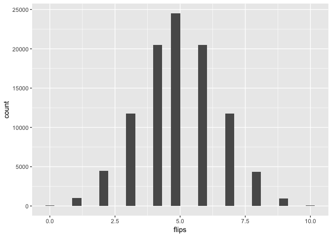
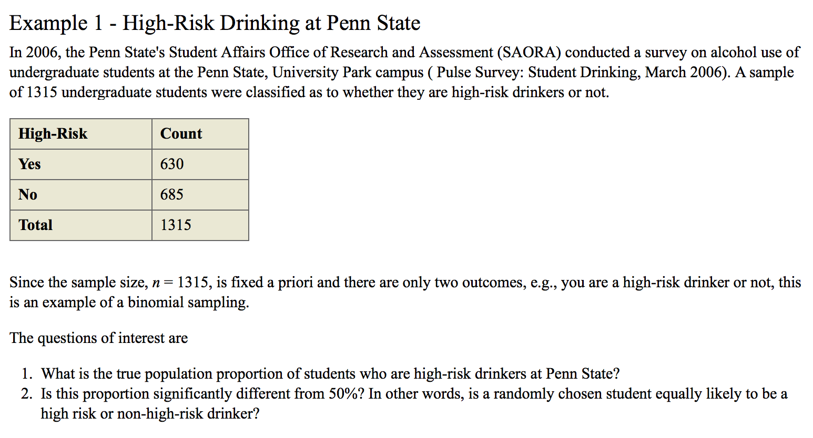
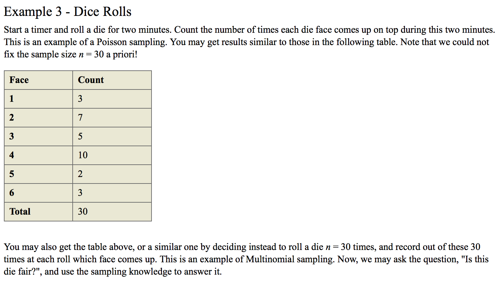
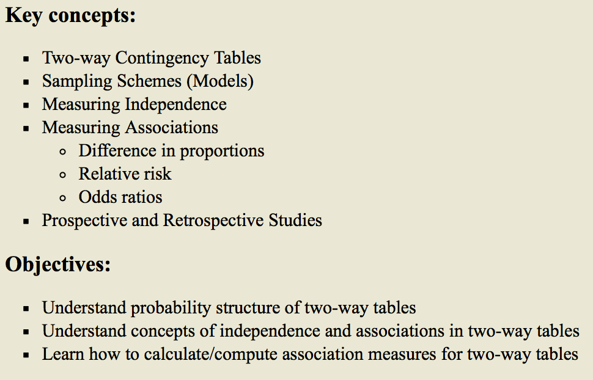

Analysis of Discrete Data
================
Shravan Kuchkula
11/7/2017

-   [What is covered in the page ?](#what-is-covered-in-the-page)
-   [Introduction](#introduction)
-   [Discrete data types](#discrete-data-types)
-   [Binomial Distribution](#binomial-distribution)
-   [Properties of a Binomial](#properties-of-a-binomial)
-   [One-way frequency table](#one-way-frequency-table)
-   [Goodness of fit test](#goodness-of-fit-test)
-   [Two-way Tables: Concept of Independence and Association](#two-way-tables-concept-of-independence-and-association)

What is covered in the page ?
-----------------------------

-   **`Types of discrete data`**
-   **`What is a random variable ?`**
-   **`What is a binomial random variable ?`**
-   **`What are the properties of a binomial variable ?`**
-   **`What is a binomial distribution ?`**
-   **`rbinom()`** - Use simulation to calculate probabilities
-   **`dbinom()`** - Calculate exact probability density of a binomial
-   **`pbinom()`** - Calculate exact cumulative probability density of a binomial
-   **`What is Expected value and Variance of a probability distribution ?`**
-   **`rnorm()`** -
-   **`pnorm()`** -
-   **`What is Chi-Square distribution ?`**
-   **`How to calculate Chi-Square statistic of a contingency table ?`**
-   **`What is one-way frequecy table ?`**
-   **`Goodness-of-fit test`**
-   **`Two-way Tables: Concept of Independence and Association`**

Introduction
------------

The focus of this page is multivariate analysis of discrete data. The modern statistical inference has many approaches/models for discrete data. When talking about discrete data, it helps to review what are the types of discrete data.

Discrete data types
-------------------

Measures on categorical or discrete variables consist of assigning observations to one of a number of categories in terms of counts or proportions. The categories can be unordered or ordered.

Counts and Proportions

Counts are variables representing frequency of occurrence of an event:

-   Number of students taking this class.
-   Number of people who vote for a particular candidate in an election.

Proportions or “bounded counts” are ratios of counts:

-   Number of students taking this class divided by the total number of graduate students.
-   Number of people who vote for a particular candidate divided by the total number of people who voted.

Discretely measured responses can be:

-   **Nominal (unordered) variables**, e.g., gender, ethnic background, religious or political affiliation
-   **Ordinal (ordered) variables**, e.g., grade levels, income levels, school grades
-   **Discrete interval variables** with only a few values, e.g., number of times married
-   **Continuous variables** grouped into small number of categories, e.g., income grouped into subsets, blood pressure levels (normal, high-normal, etc)

Binomial Distribution
---------------------

First let's start by doing some coin flips in R. By exploring the coin-flipping by the R programming language, you will learn the basic laws and methods of probability. Each time I flip a fair coin, it has a 50% chance of being a head and a 50% chance of being tails. When you flip a coin and before you look at the result, it is a random variable. We call one case of simulating a random variable a `draw`. You can use R to simulate this random event. Using the `rbinom` function. This is named because it is a random draw from a `binomial distribution`. rbinom takes 3 arguments, first is the number of random draws we are doing - a draw being a single outcome for a random variable. Second is the number of coins we are flipping on each draw. Third is the probability of a heads. There are 2 possible outcomes for this function, 0 or 1. Throughout this page, we will refer 1 as heads and 0 as tails.

``` r
rbinom(1, 1, .5)
```

    ## [1] 1

You can flip multiple coins by changing the first argument. Here the result is 5 heads and 5 tails.

``` r
rbinom(10, 1, .5)
```

    ##  [1] 1 0 0 1 0 0 0 1 0 1

Let's run that again, this time we got 3 heads and 7 tails.

``` r
rbinom(10, 1, .5)
```

    ##  [1] 0 0 1 0 1 0 1 1 1 0

> Each time we do a set of flips we will see a different outcome. That is, it is random.

Right now each draw has only 1 coin flip, rather than counting heads this way, we could just take 1 draw and use the second argument to specify how many coins should be flipped within each draw. At this point, our function will just return the number of heads out of 10

``` r
rbinom(1, 10, .5)
```

    ## [1] 1

Here, we did 1 random draw and got a result shown above.

Let's digress a bit to understand what does a `random variable` mean ?

X is a random variable (what do we mean by that ?) Example: Let X be the number of heads when you flip a coin 10 times. In the first draw (or for sake of simplicity call it an attempt) you get 5 heads. 1st draw -&gt; 5 heads 2nd draw -&gt; 8 heads 3rd draw -&gt; 9 heads (lucky!!) 4th draw -&gt; 4 heads 5th draw -&gt; 5 heads .... so on.

This can be simulated in R very easily with the use of `rbinom()` function. The first argument represents the number of draws (or simulations). The second argument represents the size of the variable i.e how many times you flip the coin in each draw. The third argument represents the probability of getting a head in each flip.

So, if you want to do 10 draws (or simulations), with a size of 10 and p = 0.5, you get the below results.

A thing to notice here is that the X value (remember X represents number of heads) in each draw is in between 0 and 10. That is, X can take any value between 0 and 10. It is a random variable whose value lies between 0 and 1. Now ask yourselves this, "what is the probability that your random variable X takes a value of 0 ?"

``` r
rbinom(10, 10, .5)
```

    ##  [1] 7 7 3 5 6 6 5 4 5 6

Let's digress one more time to understand what is meant by a binomial variable ?

Example: Let X be the number of heads when you flip a coin 10 times. X is a binomial variable ( what makes it a binomial variable ? )

-   **Made up of independent trails** ( by trail we mean a flip). In our case, yes the variable X is made up of independent trails. i.e, a flip (trail) is not dependent on the outcome of the earlier flip (trail). An example of a dependent trail is "drawing 2 kings from a deck of 52 cards without replacement".
-   **Each trial can be classified as either success or failure** . In our case, on each of the flips (trials) we are either going to have a head (success) or tail (failure), i.e, each trial can be classified as success or failure.
-   **Fixed number of trials** so in this case, we are saying that we have 10 trials (flips of our coin).
-   **Probability of success on each trial (flip) is constant** In our case, the probability on each trial is going to be same.

Now that we have seen a example of a binomial random variable X, let's see what is *NOT* a binomial variable.

Let Y = number of kings after taking 2 cards from the standard deck of cards *without replacement*. So in this case, we meet the following two criteria for a binomial variable: \* **Each trial can be classified as either success or failure** i.e, here, each trial is when you take a card out of the deck, if you get a king, then that would be a success. If you do not get a king that would be a failure. So each trial can be classified as success or failure. \* **Fixed number of trials** in this case we are taking 2 cards out of the deck.

BUT, it does not meet the 2 other properties of a binomial variable.

-   **Made up of independent trials** (by a trial we mean taking a card out without replacement). In our case, no the varialbe Y is not made up of independent trials. Probability of getting a king on 1st trail is Pr(King on 1st trail) = 4/52, but what is the probability of getting a king on the 2nd trial ? Well, it depends on what happend on the 1st trial. If the first trial you had a king, then there will be 3 kings left and 51 cards left. So the probability of getting a king in the second trail (given that the first trial was a king is) Pr(King on 2nd trial | king on 1st trial ) = 3/51, and Pr(king on 2nd trial | no king on 1st trial) = 4/51. Thus, we can say that both these trials are not independent.

-   **Probability of success on each trial (getting a king) is constant** NO, as shown above, the probability is different for each trial.

Thus, Y is *NOT* a binomial random variable.

Until now, we have been talking about there being a 50% chance of head and 50% chance of tail, but not all random events have an equal likelihood of happening. You can control the probability by setting the third parameter.

``` r
rbinom(10, 10, 0.8)
```

    ##  [1] 10  8  5  8  8  9  8  7  5  7

Consider this process of flip a number of baised coin and counting the number of heads. Each outcome X is a random variable that follows a binomial distribution.

> A probability distribution is a mathematical description of the possible outcomes of a random variable.

``` r
library(ggplot2)
flips <- rbinom(100000, 10, .5)
qplot(flips)
```



Out of these 100000 draws, about 25% are equal to 5. You can use a small trick in R to get this value.

``` r
mean(flips == 5)
```

    ## [1] 0.24526

This number gives the fraction of values equal to 5. Here, we used simulation to figure out the probability. You can get the same result, using the `dbinom` function. Pr(X == 5).

``` r
dbinom(5, 10, .5)
```

    ## [1] 0.2460938

`dbinom(5, 10, .5)` Read this as: Probability that X == 5 (i.e, probability that the binomial random variable X takes the value of 5 - i.e you get 5 heads/10 flips - what is that probability ?). If you did not have the dbinom function, you would have to get this answer by using simulation using `rbinom(100000, 10, .5)`, here you are simulating 100,000 draws ( 1 draw here represents 10 flips and counting the number of heads), but you don't have to use simulation, because dbinom can give you that answer.

Pr(X == 5) can also be read as the `"density of the binomial at 5"`

> Remember: Pr(X == 5) can be calculated using dbinom(5, 10, .5)

Understand 2 things here:

1.  Calcuating the exact probability density (not through simulation, if using simulation then use rbinom) using dbinom. i.e Pr(X == 5)
2.  Calculating the cumulative probablity density (you can also do this through simulation) using pbinom. i.e Pr(X &lt;= 5)

Much like the density, R provides a fuction to get the exact Cumulative density of the binomial using the `pbinom()` function.

`pbinom(5, 10, .5)` Read this as: Probability that a binomial with 10 flips gets 5 or fewer heads.

``` r
pbinom(5, 10, .5)
```

    ## [1] 0.6230469

If you use `pbinom` function, you can get the cumulative density. Pr(X &lt;= 4)

``` r
pbinom(4, 10, .5)
```

    ## [1] 0.3769531

Properties of a Binomial
------------------------

Let's first understand Expected Value and Variance. When we are talking about a probability distribution we are often interested in summarizing it into few descriptive statistics. Two of the most interesting properties are 1. Where the distribution is centered and 2. How widely spread out it is ? . We describe these by the expected value and the variance. The expected value is the mean of the distribution. If you imagine we drew an infinite number of values from the distribution, the expected value would be the average of all those values would be.

Let's try to find the Expected Value of the binomial distribution X ~ Binomial(size, p), with size = 10 and p = 0.5. We can't draw an infinite number of values from the distribution, but we can draw a lot of them. As seen earlier, we can use `rbinom()` to simulate 100,000 draws with size = 10 and p = 0.5. Then, use the `mean()` function to get the average of those draws.

``` r
# X ~ Binomial(size, p)
flips <- rbinom(100000, 10, 0.5)
mean(flips)
```

    ## [1] 4.99899

We see that the average is very close to 5. This is the center of the distribution. If we tried to sample from a binomial of size = 100 and p = 0.2 and calculate the expected value, we would get a value close to 20.

``` r
mean(rbinom(100000, 100, 0.2))
```

    ## [1] 20.00103

Notice the pattern !! There is a general rule. We can get the expected value of a binomial distribution by multiplying the size (or the number of flips) by the probability that each is heads. The expected value measures the center of the distribution.

> E\[X\] = size . p

We also want to measure how spread out the results are. R provides the `var()` function to calculate the variance from a particular sample. So, we can simulate 100,000 draws of a binomial distribution with size = 10 and probability = 0.5. And then use var() to find the variance of that distribution.

``` r
var(rbinom(100000, 10, .5))
```

    ## [1] 2.507394

The variance of the Binomial distribution follows a particular rule. Which is that the variance is:

> Var(X) = size . p . (1 - p)

One-way frequency table
-----------------------

A frequency table arises when sample units are classified into mutually exclusive categories; the number of units falling into each category is recorded. "One way" means that units are classified according to a single categorical variable.



Example 2: NOTE the use of poisson distribution here:


> Relate them to Prospective or Retrospective study that prof was talking about.



Why is it important to know the random mechanism that generated the data ? (or) What are some ways of generating these one-way tables of counts?

Any data analysis requires some assumptions about the data generation process. For continuous data and linear regression, for example, we assume that the response variable have been randomly generated from a `normal distribution`. For categorical data we will often assume that data have been generated from a `Poisson, binomial or multinomial distribution`. *Statistical analysis depends on the data generation mechanism*.

The following sampling methods correspond to the distributions considered:

-   **Unrestricted sampling** - corresponds to Poisson Distribution.
-   **Sampling with fixed total sample size** - corresponds to Binomial or Multinomial distributions.

Poisson Sampling: Poisson sampling assumes that the random mechanism to generate the data can be described by a Poisson distribution. It is useful for modeling counts or events that occur randomly over a fixed period of time or in a fixed space. Often it is useful when the probability of any particular incidence happening is very small while the number of incidences is very large.

Binomial Sampling:

Multinomial Sampling:

Goodness of fit test
--------------------

A goodness-of-fit test, in general, refers to measuring how well do the observed data correspond to the fitted (assumed) model. We will use this concept throughout the course as a way of checking the model fit. Like in a linear regression, in essence, the goodness-of-fit test compares the observed values to the expected (fitted or predicted) values.

A goodness-of-fit statistic tests the following hypothesis:

> H0: the model M0 fits vs HA: the model M0 does not fit (or, some other model MA fits)

Two-way Tables: Concept of Independence and Association
-------------------------------------------------------


