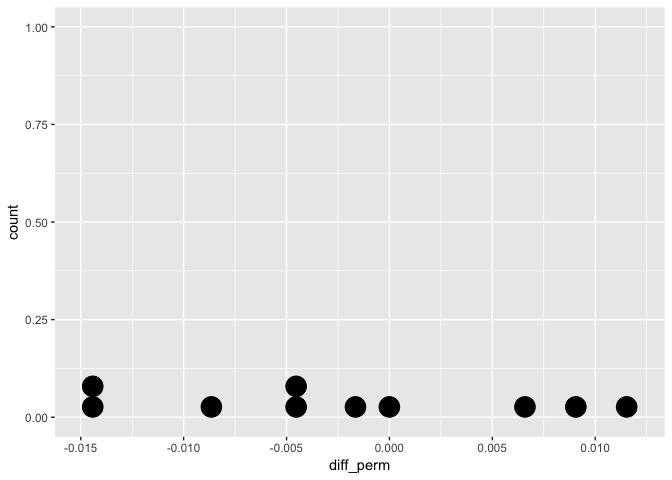
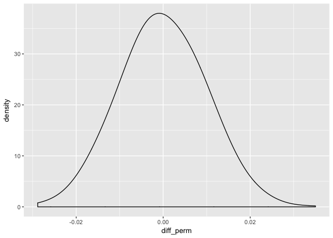

Inference
================
Shravan Kuchkula
10/19/2017

-   [Foundations of inference](#foundations-of-inference)
    -   [Introduction to ideas of inference](#introduction-to-ideas-of-inference)
-   [Randomized distributions](#randomized-distributions)
-   [NHANES dataset](#nhanes-dataset)
-   [Data set description](#data-set-description)
-   [Understanding the NULL DISTRIBUTION](#understanding-the-null-distribution)
    -   [Randomization density](#randomization-density)

Foundations of inference
------------------------

One of the foundational aspects of statistical analysis is inference, or the process of drawing conclusions about a larger population from a sample of data. Although counter intuitive, the standard practice is to attempt to disprove a research claim that is not of interest. For example, to show that one medical treatment is better than another, we can assume that the two treatments lead to equal survival rates only to then be disproved by the data. Additionally, we introduce the idea of a p-value, or the degree of disagreement between the data and the hypothesis. We also dive into confidence intervals, which measure the magnitude of the effect of interest (e.g. how much better one treatment is than another).

### Introduction to ideas of inference

In this chapter, you will investigate how repeated samples taken from a population can vary. It is the variability in samples that allow you to make claims about the population of interest. It is important to remember that the research claims of interest focus on the population while the information available comes only from the sample data.

> What is statistical inference ? The process of making claims about a population based on information from a sample.

Typically, the data represent only a small portion of a larger group that we would like to summarize.

Randomized distributions
------------------------

The idea behind statistical inference is to understand samples from a hypothetical population where the null hypothesis is true. For example, for east and west coasts, the cola preference is the same. As a way of summarizing each of the null samples, we calculate 'one statistic' from each sample. Here, the statistic is the difference in the proportion of west coast people who prefer cola and the proportion of east coast people who prefer cola. Where each of the proportion is denoted by p-hat. The difference in p-hat's changes with each sample. It could be zero, positive, negative. The point is, that it keeps changing.

We can build a distribution of the differences in proportions (assuming the null hypothesis) i.e assuming that there is no link b/w location and soda preference, is true.

> Generating a distribution of the statistic from the null population gives information about whether the observed data are inconsistent with the null hypothesis.

NHANES dataset
--------------

Thoughout this chapter, you will use the `NHANES` dataset from the `NHANES` R package. These data are collected by the CDC and can be thought of as a random sample of US residents.

Before moving on to investigate particular variables, you'll have an opportunity to briefly explore the data in this exercise.

``` r
# Load all the libraries
installRequiredPackages <- function(pkg){
  new.pkg <- pkg[!(pkg %in% installed.packages()[,"Package"])]
  if (length(new.pkg))
    install.packages(new.pkg, dependencies = TRUE)
  sapply(pkg, require, character.only = TRUE)
}

libs <- c("readr", "dplyr", "tidyr", "ggplot2",
          "magrittr", "markdown", "knitr", "yaml",
          "corrplot", "GGally", "broom", "psych", "car",
          "NHANES")

installRequiredPackages(libs)
```

    ## Loading required package: readr

    ## Loading required package: dplyr

    ## 
    ## Attaching package: 'dplyr'

    ## The following objects are masked from 'package:stats':
    ## 
    ##     filter, lag

    ## The following objects are masked from 'package:base':
    ## 
    ##     intersect, setdiff, setequal, union

    ## Loading required package: tidyr

    ## Loading required package: ggplot2

    ## Loading required package: magrittr

    ## 
    ## Attaching package: 'magrittr'

    ## The following object is masked from 'package:tidyr':
    ## 
    ##     extract

    ## Loading required package: markdown

    ## Loading required package: knitr

    ## Loading required package: yaml

    ## Loading required package: corrplot

    ## Loading required package: GGally

    ## 
    ## Attaching package: 'GGally'

    ## The following object is masked from 'package:dplyr':
    ## 
    ##     nasa

    ## Loading required package: broom

    ## Loading required package: psych

    ## 
    ## Attaching package: 'psych'

    ## The following objects are masked from 'package:ggplot2':
    ## 
    ##     %+%, alpha

    ## Loading required package: car

    ## 
    ## Attaching package: 'car'

    ## The following object is masked from 'package:psych':
    ## 
    ##     logit

    ## The following object is masked from 'package:dplyr':
    ## 
    ##     recode

    ## Loading required package: NHANES

    ##    readr    dplyr    tidyr  ggplot2 magrittr markdown    knitr     yaml 
    ##     TRUE     TRUE     TRUE     TRUE     TRUE     TRUE     TRUE     TRUE 
    ## corrplot   GGally    broom    psych      car   NHANES 
    ##     TRUE     TRUE     TRUE     TRUE     TRUE     TRUE

``` r
names(NHANES)
```

    ##  [1] "ID"               "SurveyYr"         "Gender"          
    ##  [4] "Age"              "AgeDecade"        "AgeMonths"       
    ##  [7] "Race1"            "Race3"            "Education"       
    ## [10] "MaritalStatus"    "HHIncome"         "HHIncomeMid"     
    ## [13] "Poverty"          "HomeRooms"        "HomeOwn"         
    ## [16] "Work"             "Weight"           "Length"          
    ## [19] "HeadCirc"         "Height"           "BMI"             
    ## [22] "BMICatUnder20yrs" "BMI_WHO"          "Pulse"           
    ## [25] "BPSysAve"         "BPDiaAve"         "BPSys1"          
    ## [28] "BPDia1"           "BPSys2"           "BPDia2"          
    ## [31] "BPSys3"           "BPDia3"           "Testosterone"    
    ## [34] "DirectChol"       "TotChol"          "UrineVol1"       
    ## [37] "UrineFlow1"       "UrineVol2"        "UrineFlow2"      
    ## [40] "Diabetes"         "DiabetesAge"      "HealthGen"       
    ## [43] "DaysPhysHlthBad"  "DaysMentHlthBad"  "LittleInterest"  
    ## [46] "Depressed"        "nPregnancies"     "nBabies"         
    ## [49] "Age1stBaby"       "SleepHrsNight"    "SleepTrouble"    
    ## [52] "PhysActive"       "PhysActiveDays"   "TVHrsDay"        
    ## [55] "CompHrsDay"       "TVHrsDayChild"    "CompHrsDayChild" 
    ## [58] "Alcohol12PlusYr"  "AlcoholDay"       "AlcoholYear"     
    ## [61] "SmokeNow"         "Smoke100"         "Smoke100n"       
    ## [64] "SmokeAge"         "Marijuana"        "AgeFirstMarij"   
    ## [67] "RegularMarij"     "AgeRegMarij"      "HardDrugs"       
    ## [70] "SexEver"          "SexAge"           "SexNumPartnLife" 
    ## [73] "SexNumPartYear"   "SameSex"          "SexOrientation"  
    ## [76] "PregnantNow"

As you can see there are far too many variables in this dataset.

Data set description
--------------------

This is survey data collected by the US National Center for Health Statistics (NCHS) which has conducted a series of health and nutrition surveys since the early 1960's. Since 1999 approximately 5,000 individuals of all ages are interviewed in their homes every year and complete the health examination component of the survey. The health examination is conducted in a mobile examination centre (MEC).

You can get more info about this dataset by using `?NHANES`

Understanding the NULL DISTRIBUTION
-----------------------------------

Use R to randomly permute the observations and calculate a difference in `proportions` that could arise from a null distribution. Using the NHANES dataset, let's investigate the relationship between gender and home ownership.

HomeOwn: One of Home, Rent, or Other indicating whether the home of study participant or someone in their family is owned, rented or occupied by some other arrangement.

Gender: Gender (sex) of study participant coded as male or female

Subset the NHANES dataset to consider only individuals whose home ownership status is either "Own" or "Rent". Save the result to homes.

``` r
# Subset the data: homes
homes <- NHANES %>%
  select(Gender, HomeOwn) %>%
  filter(HomeOwn %in% c("Own", "Rent"))

nrow(homes)
```

    ## [1] 9712

``` r
nrow(subset(homes, Gender == "female"))
```

    ## [1] 4890

``` r
nrow(subset(homes, Gender == "male"))
```

    ## [1] 4822

Perform a single permutation to evaluate whether home ownership status (i.e. HomeOwn) differs between the "female" and "male" groups:

Let's start simple. First, let's take a permutation of HomeOwn variable and store it in HomeOwn\_perm. Here, HomeOwn is the original data and HomeOwn\_perm is just 1 permutation of this original data. Remember, we are trying to understand the logic of inference here.

``` r
homes %>%
  mutate(HomeOwn_perm = sample(HomeOwn)) %>%
  head(10)
```

    ## # A tibble: 10 × 3
    ##    Gender HomeOwn HomeOwn_perm
    ##    <fctr>  <fctr>       <fctr>
    ## 1    male     Own         Rent
    ## 2    male     Own          Own
    ## 3    male     Own          Own
    ## 4    male     Own         Rent
    ## 5  female    Rent         Rent
    ## 6    male    Rent         Rent
    ## 7    male     Own          Own
    ## 8  female     Own         Rent
    ## 9  female     Own         Rent
    ## 10 female     Own          Own

Next, let's group them by `Gender`.

``` r
homes %>%
  mutate(HomeOwn_perm = sample(HomeOwn)) %>%
  group_by(Gender) %>%
  summarise(n = n())
```

    ## # A tibble: 2 × 2
    ##   Gender     n
    ##   <fctr> <int>
    ## 1 female  4890
    ## 2   male  4822

Next, group them by gender and this time calculate the proportion of homeowners in the `HomeOwn_perm` column and the original column `HomeOwn`. Remember for homeowners the value of `HomeOwn` (and `HomeOwn_perm`) will be "Own".

In both the original data and in the permuted data, compute the proportion of individuals who own a home. Note that this will calculate proportions for both genders since you've grouped by the Gender variable in the line before it.

``` r
# Perform one permutation 
homes %>%
  mutate(HomeOwn_perm = sample(HomeOwn)) %>%
  group_by(Gender) %>%
  summarize(prop_own_perm = mean(HomeOwn_perm == "Own"), 
            prop_own = mean(HomeOwn == "Own"))
```

    ## # A tibble: 2 × 3
    ##   Gender prop_own_perm  prop_own
    ##   <fctr>         <dbl>     <dbl>
    ## 1 female     0.6607362 0.6654397
    ## 2   male     0.6623808 0.6576109

Now the question was: "Perform a single permutation to evaluate whether home ownership status (i.e. HomeOwn) differs between the "female" and "male" groups"

Take the difference b/w female and male groups:

Using the diff() function, calculate the difference in proportion of home ownership for both prop\_own\_perm, the permuted data, and prop\_own, the original data.

``` r
homes %>%
  mutate(HomeOwn_perm = sample(HomeOwn)) %>%
  group_by(Gender) %>%
  summarize(prop_own_perm = mean(HomeOwn_perm == "Own"), 
            prop_own = mean(HomeOwn == "Own")) %>%
  summarize(diff_perm = diff(prop_own_perm),
            diff_orig = diff(prop_own))
```

    ## # A tibble: 1 × 2
    ##     diff_perm    diff_orig
    ##         <dbl>        <dbl>
    ## 1 0.009470313 -0.007828723

> Keep in mind, this is just a single random permutation. Next, you'll look at several permuted differences to see how they compare with the observed difference.

> A side note, this difference in proportion is nothing but our statistic.

Natural variability can be modeled from shuffling observations around to remove any relationship that might exist in the population. This is done with the `rep_sample_n()` function from the `oilabs` package. Within it, you must specify arguments for the data (tbl), the sample size, the number of samples to take (reps), and whether sampling should be done with or without replacement (replace). The output includes a new column, replicate, which indicates the sample number. For example,

``` r
# Source: https://github.com/OpenIntroOrg/oilabs-r-package/blob/master/R/rep_sample_n.R

#' Repeating sampling.
#' 
#' @param tbl tbl of data.
#' @param size The number of rows to select.
#' @param replace Sample with or without replacement?
#' @param reps The number of samples to collect.
#' @return A tbl_df that aggregates all created samples, with the addition of a \code{replicate} column that the tbl_df is also grouped by
#' @export

rep_sample_n <- function(tbl, size, replace = FALSE, reps = 1)
{
    n <- nrow(tbl)
    i <- unlist(replicate(reps, sample.int(n, size, replace = replace), simplify = FALSE))

    rep_tbl <- cbind(replicate = rep(1:reps,rep(size,reps)), tbl[i,])

    dplyr::group_by(rep_tbl, replicate)
}
```

Use the above function.

``` r
homes %>%
  rep_sample_n(size = 5, reps = 3)
```

    ## Source: local data frame [15 x 3]
    ## Groups: replicate [3]
    ## 
    ##    replicate Gender HomeOwn
    ##        <int> <fctr>  <fctr>
    ## 1          1   male     Own
    ## 2          1   male     Own
    ## 3          1 female    Rent
    ## 4          1 female     Own
    ## 5          1   male     Own
    ## 6          2   male     Own
    ## 7          2   male     Own
    ## 8          2   male     Own
    ## 9          2   male     Own
    ## 10         2   male    Rent
    ## 11         3 female     Own
    ## 12         3   male     Own
    ## 13         3 female     Own
    ## 14         3   male     Own
    ## 15         3   male    Rent

will return three samples of 5 observations from the homes dataset you created in the last exercise. The first 5 rows will have a value of 1 in the replicate column, the next 5 rows will have a value of 2, and so on. Note that the default value for the replace argument is FALSE.

The rep\_sample\_n() function is useful here because it adds the replicate column. This ensures that you can keep many different random samples in one table without getting them confused. For example, grouping by the values in the replicate column and using a summarise() call lets you effectively do a calculation on every one of the shuffled datasets that you've made. You can see why this makes our lives easier when we're making more than one or two samples!

In this exercise, you will permute the home ownership variable 10 times. By doing so, you will ensure that there is no relationship between home ownership and gender, so any difference in home ownership proportion for female versus male will be due only to natural variability.

``` r
# Perform 10 permutations
homeown_perm <- homes %>%
  rep_sample_n(size = nrow(homes), reps = 10) %>%
  mutate(HomeOwn_perm = sample(HomeOwn)) %>%
  group_by(replicate, Gender) %>%
  summarize(prop_own_perm = mean(HomeOwn_perm == "Own"), 
            prop_own = mean(HomeOwn == "Own")) %>%
  summarize(diff_perm = diff(prop_own_perm),
            diff_orig = diff(prop_own)) # male - female
```

print differences to the console

``` r
print(homeown_perm)
```

    ## # A tibble: 10 × 3
    ##    replicate    diff_perm    diff_orig
    ##        <int>        <dbl>        <dbl>
    ## 1          1 -0.028834695 -0.007828723
    ## 2          2 -0.001650496 -0.007828723
    ## 3          3  0.021826767 -0.007828723
    ## 4          4  0.012353486 -0.007828723
    ## 5          5 -0.006181196 -0.007828723
    ## 6          6 -0.004121787 -0.007828723
    ## 7          7 -0.016890123 -0.007828723
    ## 8          8  0.002468322 -0.007828723
    ## 9          9 -0.014418832 -0.007828723
    ## 10        10 -0.002474260 -0.007828723

Using geom\_dotplot(), plot the differences in proportions obtained by shuffling the HomeOwn variable. Adjust the size of the dots by including binwidth = .001 in your call to geom\_dotplot()

``` r
# Dotplot of 10 permuted differences in proportions
ggplot(homeown_perm, aes(x = diff_perm)) + 
  geom_dotplot(binwidth = .001)
```



By permuting the home ownership variable multiple times, you generate differences in proportions that are consistent with the assumption that the variables are unrelated.

``` r
# Perform 100 permutations
homeown_perm <- homes %>%
  rep_sample_n(size = nrow(homes), reps = 100) %>%
  mutate(HomeOwn_perm = sample(HomeOwn)) %>%
  group_by(replicate, Gender) %>%
  summarize(prop_own_perm = mean(HomeOwn_perm == "Own"), 
            prop_own = mean(HomeOwn == "Own")) %>%
  summarize(diff_perm = diff(prop_own_perm),
            diff_orig = diff(prop_own)) # male - female

# Dotplot of 100 permuted differences in proportions
ggplot(homeown_perm, aes(x = diff_perm)) + 
  geom_dotplot(binwidth = .001)
```


### Randomization density

Using 100 repetitions allows you to understand the mechanism of permuting. However, 100 is not enough to observe the full range of likely values for the null differences in proportions.

In this exercise, you'll repeat the process 1000 times to get a sense for the complete distribution of null differences in proportions.

Generate 1000 differences in proportions by shuffling the HomeOwn variable and following the same procedure as before.

``` r
# Perform 1000 permutations
homeown_perm <- homes %>%
  rep_sample_n(size = nrow(homes), reps = 1000) %>%
  mutate(HomeOwn_perm = sample(HomeOwn)) %>%
  group_by(replicate, Gender) %>%
  summarize(prop_own_perm = mean(HomeOwn_perm == "Own"), 
            prop_own = mean(HomeOwn == "Own")) %>%
  summarize(diff_perm = diff(prop_own_perm),
            diff_orig = diff(prop_own)) # male - female

# Density plot of 1000 permuted differences in proportions
ggplot(homeown_perm, aes(x = diff_perm)) + 
  geom_density(adjust=2)
```


