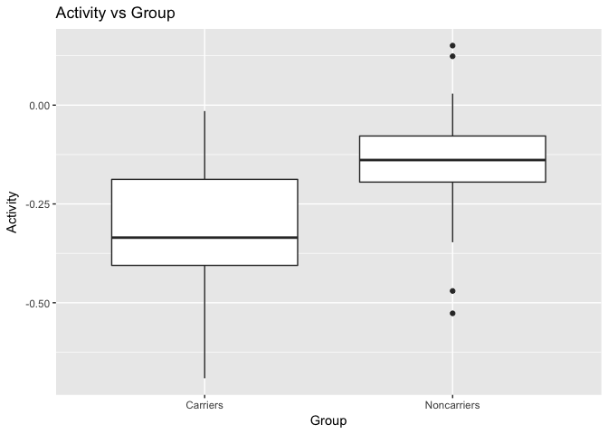
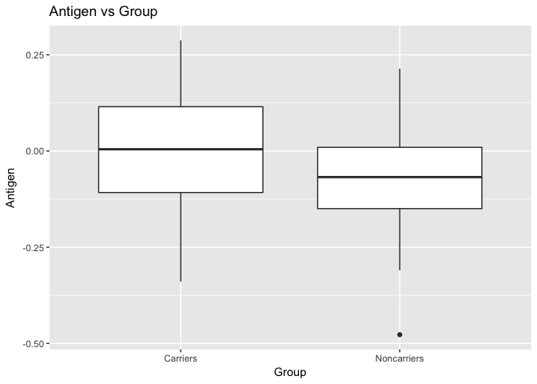
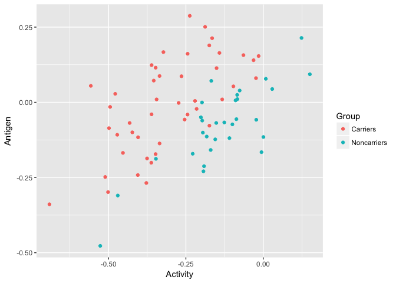
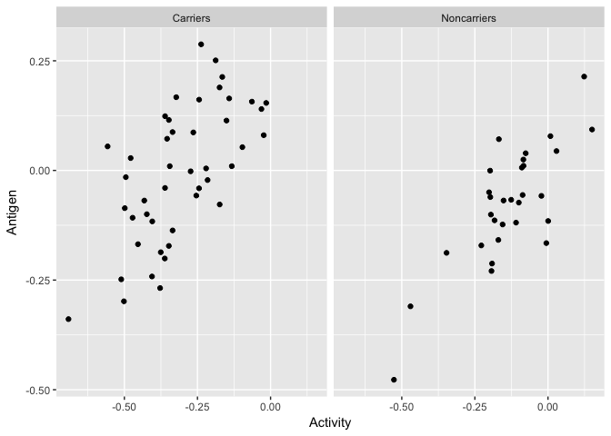

# MANOVA
Shravan Kuchkula  
9/20/2017  

MANOVA is geared towards doing a simple ANOVA model with multiple response variables.

LDA on the other hand, says hey, “using the response variables, can we predict what factor level the observation is coming from?”.

## Introduction
The hemophilia data set contains two measured variables on 75 women, belonging to two groups: n1=30 of them are non-carriers (normal group) and n2=45 are known hemophilia A carriers (obligatory carriers).  MANOVA and LDA are linked together in terms of what is going on under the hood mathematically.  MANOVA though is geared towards doing a simple ANOVA model with multiple response variables.  LDA on the other hand, says hey, “using the response variables, can we predict what factor level the observation is coming from?”. The variables in the study are:


* **Group** - Categorical variable with levels: Non-carriers or Carriers
* **Activity** - Continuous variable.
* **Antigen** - Continuous variable.

## Data gathering and cleaning
All the required libraries are loaded.


```r
source('libraries.R')
```

The data is retrieved and stored into a data frame using `read.csv`.


```r
hemophil <- read.csv("/Users/Shravan/Downloads/Unit7Exercise/Hemophil.csv")
```


## Exploratory Data Analysis
Summary statistics per response variable by group. Use the `describeBy` from `psych` package.


```r
describeBy(hemophil, hemophil$Group)
```

```
## $Carriers
##          vars  n  mean   sd median trimmed  mad   min   max range  skew
## Group*      1 45  1.00 0.00   1.00    1.00 0.00  1.00  1.00  0.00   NaN
## Activity    2 45 -0.31 0.15  -0.34   -0.31 0.17 -0.69 -0.01  0.68  0.00
## Antigen     3 45 -0.01 0.16   0.00    0.00 0.17 -0.34  0.29  0.63 -0.24
##          kurtosis   se
## Group*        NaN 0.00
## Activity    -0.53 0.02
## Antigen     -0.83 0.02
## 
## $Noncarriers
##          vars  n  mean   sd median trimmed  mad   min  max range  skew
## Group*      1 30  2.00 0.00   2.00    2.00 0.00  2.00 2.00  0.00   NaN
## Activity    2 30 -0.13 0.14  -0.14   -0.13 0.08 -0.53 0.15  0.68 -0.61
## Antigen     3 30 -0.08 0.13  -0.07   -0.07 0.13 -0.48 0.21  0.69 -0.59
##          kurtosis   se
## Group*        NaN 0.00
## Activity     0.93 0.03
## Antigen      1.09 0.02
## 
## attr(,"call")
## by.data.frame(data = x, INDICES = group, FUN = describe, type = type)
```

Draw a boxplot to visualize the effect of a categorical predictor on a continuous response variable. 
First we will draw Activity ~ Group and then we will draw Antigen ~ Group.


```r
ggplot(data = hemophil, aes(x = Group, y = Activity)) +
  geom_boxplot() +
  ggtitle("Activity vs Group")
```

<!-- -->


```r
ggplot(data = hemophil, aes(x = Group, y = Antigen)) +
  geom_boxplot() +
  ggtitle("Antigen vs Group")
```

<!-- -->

Our main question is, Are the Activity/Antigen means for the 2 groups statistically different from one another ? Well, looking at the box plot for Activity/Antigen by group definitely seems that they are different, but we want to formally answer this question using a one-way ANOVA model.

### Understanding one-way ANOVA.
## ANOVA in R
Normally, you do not have to do all calculations yourself to get the F-value and to see whether or not the null hypothesis (i.e. that all groups are equal) should be rejected. R's aov() function does the heavy lifting for you! Apply aov() to the hemophil data. The only argument should be a formula containing the dependent variable iq and independent variable condition. For example, aov(dependent_var ~ independent_var).


```r
# use aov for Activity
anova_hemophil <- aov(hemophil$Activity ~ hemophil$Group)

# use aov for Antigen
anova_antigen <- aov(hemophil$Antigen ~ hemophil$Group)

# summarize both the models
summary(anova_hemophil)
```

```
##                Df Sum Sq Mean Sq F value   Pr(>F)    
## hemophil$Group  1 0.5392  0.5392   23.82 6.04e-06 ***
## Residuals      73 1.6525  0.0226                     
## ---
## Signif. codes:  0 '***' 0.001 '**' 0.01 '*' 0.05 '.' 0.1 ' ' 1
```

```r
summary(anova_antigen)
```

```
##                Df Sum Sq Mean Sq F value Pr(>F)  
## hemophil$Group  1  0.093 0.09296   4.303 0.0416 *
## Residuals      73  1.577 0.02161                 
## ---
## Signif. codes:  0 '***' 0.001 '**' 0.01 '*' 0.05 '.' 0.1 ' ' 1
```

The p-value is < 0.05, which means, we reject the null hypothesis and state that atleast one of the means of the sub-groups is different. This is true for both Activity and Antigen response variables.

For Activity: The F-value is 23.82, which is really large and the p-value is really small. As a result, you have 23.82 times as much between group variance as within group variance, so you have a big effect. 
For Antigen: The F-value is 4.303, which is not that large and thus the p-value is close to 0.05. As a result, you have 4.3 times as much between group variance as within group variance, so you have a resonable effect.

These can also be visually confirmed through box plots shown above.


### Checking ANOVA assumptions
The assumptions of ANOVA are relatively simple. Similar to an independent t-test, we have a continuous dependent variable, which we assume to be normally distributed. Furthermore, we assume homogeneity of variance, which can be tested with Levene's test. It's good practice to check both assumptions before you do ANOVA, but here we'll focus on the latter. If the assumptions don't hold, then the ANOVA results won't be valid.


Perform Levene's test for the hemophil data. Use `leveneTest` from the `car` package with the dependent and independent variables as first and second arguments, respectively.


```r
# Perform leveneTest for both Activity and Antigen.
leveneTest(hemophil$Activity, hemophil$Group)
```

```
## Levene's Test for Homogeneity of Variance (center = median)
##       Df F value Pr(>F)
## group  1  0.8335 0.3643
##       73
```
If you don't specify additional arguments, the deviation scores are calculated by comparing each score to its group median. This is the default behavior, even though they are typically calculated by comparing each score to its group mean. If you want to use means and not medians, add an argument `center = mean`. Do this now and compare the results to the first test.


```r
# Perform leveneTest for both Activity and Antigen.
leveneTest(hemophil$Activity, hemophil$Group, center = mean)
```

```
## Levene's Test for Homogeneity of Variance (center = mean)
##       Df F value Pr(>F)
## group  1  1.1501 0.2871
##       73
```

```r
leveneTest(hemophil$Antigen, hemophil$Group, center = mean)
```

```
## Levene's Test for Homogeneity of Variance (center = mean)
##       Df F value Pr(>F)
## group  1  2.0118 0.1603
##       73
```

In both cases the p-value is not significant, which means, we will fail to reject the null hypothesis - which is that of equal variances. 

## Understanding Covariance

Provide a scatterplot for Carrier vs Non-Carrier for your final variables used in #2 and color code the points by group. Since we know each variable satistifies normality from #2, the only additional question is if the data are following multivariate normality with a constant covariance matrix for each group. Try to explain what visual properties you see in the plot would lead you for or against the assumption of constant covariance matrix. Recall covariance matrix is simply book keeping variance and correlation estimates for the two variables.  


```r
ggplot(data = hemophil, aes(x = Activity, y = Antigen, color = Group)) +
  geom_point()
```

<!-- -->

There are two ways of expressing the relationship between variables:

* **Covariance** 
* **Correlation**

Covariance refers to how much two variables are associated (i.e., whether two variables covary). To understand covariance, you’ll need to understand the variance and standard deviation of a single variable. Variance or standard deviation represents the average amount the data vary from the mean. The formula for variance (i.e., square of standard deviation $\sigma$) is:

$$ \sigma^2 = \frac{\sum_{i=1}^{n}(x_i - \overline{x})^2} {n-1} $$

$$ \sigma^2 = \frac{\sum_{i=1}^{n}(x_i - \overline{x})(x_i - \overline{x})} {n-1} $$

When two variables are related, changes in one variable are met with similar changes in the other variable. Thus, when one variable deviates from its mean, the other variable should deviate in a similar way.

To do this in R manually, let's consider the hemophil data set. 


```r
tempHemophil <- hemophil %>%
  mutate (sdev_activity = Activity - mean(Activity), sdev_Antigen = Antigen - mean(Antigen))
head(tempHemophil)
```

```
##         Group Activity Antigen sdev_activity sdev_Antigen
## 1 Noncarriers  -0.0056 -0.1657      0.233116  -0.13096267
## 2 Noncarriers  -0.1698 -0.1585      0.068916  -0.12376267
## 3 Noncarriers  -0.3469 -0.1879     -0.108184  -0.15316267
## 4 Noncarriers  -0.0894  0.0064      0.149316   0.04113733
## 5 Noncarriers  -0.1679  0.0713      0.070816   0.10603733
## 6 Noncarriers  -0.0836  0.0106      0.155116   0.04533733
```

The two variables `Activity` and `Antigen` clearly are related (see scatterplot). They covary because as one variables deviates from the mean in one direction, the other variable deviates from the mean in the same direction.

When there is one variable, we square the deviations to get variance:

$$ \sigma^2 = \frac{\sum_{i=1}^{n}(x_i - \overline{x})(x_i - \overline{x})} {n-1} $$

When there are two variables, we mutliply the deviation for one variable by the corresponding variable for the second variable to get the cross-product deviations:

$$ (x_i - \overline{x})(y_i - \overline{y}) $$

then we sum the cross-product deviations,

$$ \sum_{i=1}^{n}(x_i - \overline{x})(y_i - \overline{y}) $$

and finally we average the sum of all cross-product deviations to get the covariance cov(x, y):

$$ cov(x, y) = \frac{\sum_{i=1}^{n}(x_i - \overline{x})(y_i - \overline{y})} {n-1} $$

We can calculate the covariance in R as:

```r
tempHemophil <- tempHemophil %>%
  mutate(crossProduct = sdev_activity * sdev_Antigen, 
         covariance = sum(crossProduct) / (nrow(tempHemophil) - 1)) 
```

Display the covariance


```r
head(tempHemophil)
```

```
##         Group Activity Antigen sdev_activity sdev_Antigen crossProduct
## 1 Noncarriers  -0.0056 -0.1657      0.233116  -0.13096267 -0.030529493
## 2 Noncarriers  -0.1698 -0.1585      0.068916  -0.12376267 -0.008529228
## 3 Noncarriers  -0.3469 -0.1879     -0.108184  -0.15316267  0.016569750
## 4 Noncarriers  -0.0894  0.0064      0.149316   0.04113733  0.006142462
## 5 Noncarriers  -0.1679  0.0713      0.070816   0.10603733  0.007509140
## 6 Noncarriers  -0.0836  0.0106      0.155116   0.04533733  0.007032546
##   covariance
## 1 0.01219725
## 2 0.01219725
## 3 0.01219725
## 4 0.01219725
## 5 0.01219725
## 6 0.01219725
```

The covariance between these 2 variables `Activity` and `Antigen` is 0.01219725

Now, compare this with running `cov` from the stats package:


```r
cov(hemophil$Activity, hemophil$Antigen)
```

```
## [1] 0.01219725
```

Now, recall that we are interested in this Covariance topic because we are interested in learning about MANOVA. The concept of variance-covariance matrix comes into picture. 

In a variance-covariance matrix, the diagnol elements represent the `variance` and the non-diagnol elements represent the covariance between the variables.

A positive covariance indicates that as one variable deviates from the mean, the other variables deviates in the same direction. A negative covariance indicates that as one variable deviates from the mean (e.g., increases), the other variable deviates in the opposite direction (e.g., decreases).

However, the size of the covariance depends on the scale of measurement. Larger scale units will lead to larger covariance. To overcome the problem of dependence on measurement scale, we need to convert convariance to a standard set of units through standardisation by dividing the covariance by the standard deviation (i.e., similar to how we compute z-scores).

With two variables, here are two standard deviations. We simply multiply the two standard deviations $ \sigma_{x}*\sigma_{y} $ We divide the covariance by the product of the two standard deviations to get the standardised covariance, which is know n as a correlation coefficient r:

$$ r = \frac{\sum_{i=1}^{n}(x_i - \overline{x})(y_i - \overline{y})} {(n-1)(\sigma_{x}\sigma_{y})} $$


```r
(pearsonR <- cov(hemophil$Activity, hemophil$Antigen) / (sd(hemophil$Activity) * sd(hemophil$Antigen)))
```

```
## [1] 0.4717586
```

To calculate the p-value:


```r
cor.test(hemophil$Activity, hemophil$Antigen)$p.value
```

```
## [1] 1.932687e-05
```

> Note: The value of the covariance depends on the scale of measurement. A larger scale will yield a large covariance. To overcome the problem of dependence on measurement scale, we need to convert convariance to a standard set of units through standardisation by dividing the covariance by the standard deviation. By dividing the covariance of two variables by the product of their sd, we will get the correlation coefficient. 

Coming back to the main question:

Provide a scatterplot for Carrier vs Non-Carrier for your final variables used in #2 and color code the points by group. Since we know each variable satistifies normality from #2, the only additional question is if the data are following multivariate normality with a constant covariance matrix for each group. Try to explain what visual properties you see in the plot would lead you for or against the assumption of constant covariance matrix. Recall covariance matrix is simply book keeping variance and correlation estimates for the two variables. 


```r
# Scatter plot of Carrier vs Non-Carrier
ggplot(data = hemophil, aes(x = Activity, y = Antigen)) +
  geom_point() +
  facet_grid(.~ factor(Group))
```

<!-- -->

