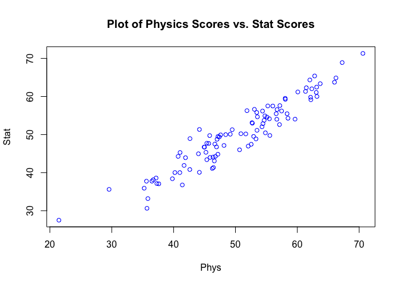
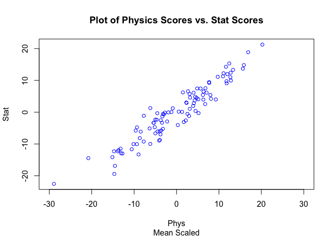
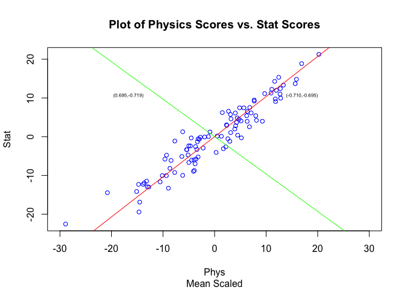
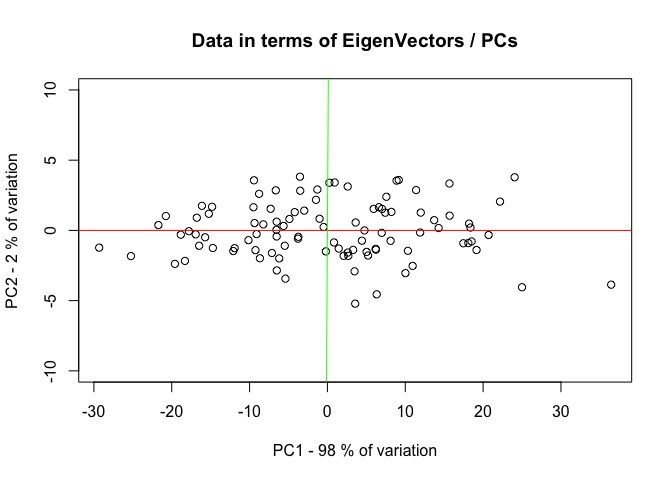
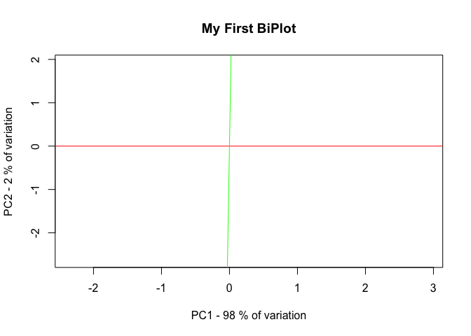
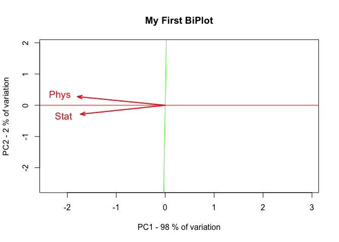
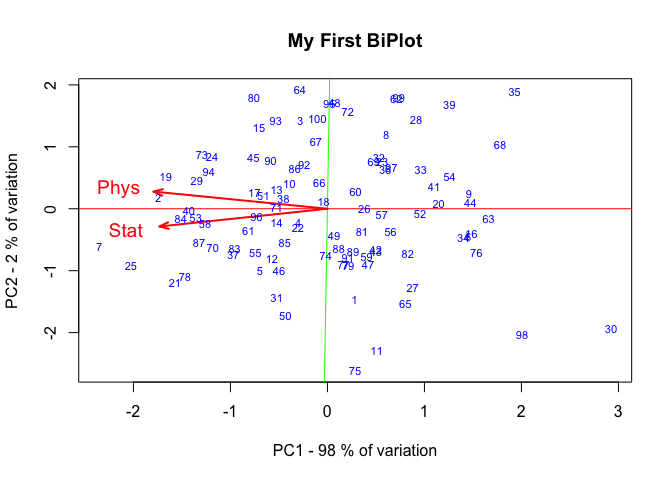

PCA in R
================
Shravan Kuchkula
10/13/2017

-   [Introduction](#introduction)
-   [Getting the data](#getting-the-data)
-   [Standardize the data](#standardize-the-data)
-   [Covariance or Correlation ?](#covariance-or-correlation)
-   [Find Eigen Values and Eigen Vectors of the Cov matrix](#find-eigen-values-and-eigen-vectors-of-the-cov-matrix)
-   [Plot the Eigen Vector (aka Principal components) over the Scaled Data](#plot-the-eigen-vector-aka-principal-components-over-the-scaled-data)
-   [Compute the PCA Scores and Plot them](#compute-the-pca-scores-and-plot-them)
-   [Introducing the BiPlot](#introducing-the-biplot)
-   [Interpreting the Bi-Plot](#interpreting-the-bi-plot)
-   [Wrap up](#wrap-up)

Introduction
------------

Principal components analysis allows us to distribute the variation in a multivariate dataset across components in a way that allows us to (hopefully) observe patterns that might not otherwise be apparent using more common analysis and graphics techniques. To do this, PCA borrows some ideas from linear algebra.

In this tutorial, we will be manually accomplishing the PCA of a sample data. Normally, we wouldn't be doing this manually, we would use one of the many R functions available to do PCA. Goal is to expose you to the terminology and concepts used in PCA.

Getting the data
----------------

``` r
# Install the required packages and load them.
# install.packages("calibrate")
library(calibrate)
library(dplyr)
```

Download the dataset

``` r
classes <- read.csv("https://raw.githubusercontent.com/steviep42/youtube/master/YOUTUBE.DIR/marks.dat")
glimpse(classes)
```

    ## Observations: 100
    ## Variables: 2
    ## $ Phys <dbl> 45.83286, 66.24545, 54.84116, 52.73309, 55.22804, 36.7177...
    ## $ Stat <dbl> 49.73412, 64.87357, 50.45485, 52.98077, 57.51052, 38.1294...

This dataset represents 100 students, all of whom have taken two tests - Phys and Stat, and their scores are recorded.

First things to do is to plot the data:

``` r
plot(classes,cex=0.9,col="blue",main="Plot of Physics Scores vs. Stat Scores")
```



There seems to be a high degree of correlation between the physics and statistics scores. So this would probably will be a good candidate for linear regression.

Now lets apply some principal components concepts here and see what we can come up with.

Standardize the data
--------------------

One of the first things to do in PCA is to standardize the data. I will explain the need to standardize and how we make the decision to choose a covariance or correlation matrix later.

Let's define a standardize function:

``` r
standardize <- function(x){(x - mean(x))}

#use apply to apply this function to the matrix
scaled.classes <- apply(classes, 2, standardize)

# plot it
plot(scaled.classes,cex=0.9,col="blue",main="Plot of Physics Scores vs. Stat Scores",sub="Mean Scaled",xlim=c(-30,30))
```



You can see that the relationship is all preserved. So all we have done is changed the scale of the data.

Covariance or Correlation ?
---------------------------

PCA is a technique used for dimentionality reduction and uncover latent patterns in the data. To do this, it borrows concepts from linear algebra, such as, `eigen values` and `eigen vectors` .

Our data has the same unit of measure in both cases, i.e. they both represent the scores. Scale is 0-100. Because of this we can standardize the data by centering by subtracting the mean and then use the `covariance matrix`. However, if our data had mixed units/scales. Eg: salary, weight etc then we would have to mean center and divide by standard deviation and then use the `correlation matrix`. The reason I point this out now is that when we use the R functions we have to make a decision as to which approach to use.

Find Eigen Values and Eigen Vectors of the Cov matrix
-----------------------------------------------------

Since we are going to use the Cov matrix. Let's use the R function to get it.

``` r
(my.cov <- cov(scaled.classes))
```

    ##          Phys     Stat
    ## Phys 82.24725 75.61021
    ## Stat 75.61021 77.00910

And we can get the eigen values and eigen vectors by calling the `eigen` function.

``` r
(my.eigen <- eigen(my.cov))
```

    ## $values
    ## [1] 155.283739   3.972616
    ## 
    ## $vectors
    ##            [,1]       [,2]
    ## [1,] -0.7192421  0.6947595
    ## [2,] -0.6947595 -0.7192421

To make things a little clear, lets give labels to rows and columns

``` r
rownames(my.eigen$vectors) <- c("Physics","Stats")
colnames(my.eigen$vectors) <- c("PC1","PC2")
my.eigen
```

    ## $values
    ## [1] 155.283739   3.972616
    ## 
    ## $vectors
    ##                PC1        PC2
    ## Physics -0.7192421  0.6947595
    ## Stats   -0.6947595 -0.7192421

If you look closely, the sum of the eigen values is equal to the total vairance (i.e sum of diagnols in cov matrix).

``` r
sum(my.eigen$values)
```

    ## [1] 159.2564

``` r
var(scaled.classes[,1]) + var(scaled.classes[,2])
```

    ## [1] 159.2564

> The sum of the eigen values represents the total variance in the dataset. This magic allows us to use the Eigen Vectors - which are also known as the "Principal Components"

So, what we are seeing here is that the PC1 is a linear combination of the variables `Physics` and `Stats`. And the coefficients here are called `loadings` - a concept in PCA which is heard frequenctly.

> By finding the eigen vectors of the cov matrix we have essentially found the principal components.

The coefficients aka `loadings` show how strongly these variables are connected to the principal component.

``` r
(loadings <- my.eigen$vectors)
```

    ##                PC1        PC2
    ## Physics -0.7192421  0.6947595
    ## Stats   -0.6947595 -0.7192421

What we are seeing here is that PC1 (`aka Eigen vector 1`) is a linear combination of these two variables Physics and Stats. And these coefficients (can also be called loadings), indicate the strength of the relationship of these variables - Physics and Stats - with the principal component. Also in the PC1 case, both these variables trend together since they both have the same sign. Whereas in PC2 case, both the variables trend in opposite directions.

Plot the Eigen Vector (aka Principal components) over the Scaled Data
---------------------------------------------------------------------

One thing we can do with the Eigen Vectors that we found is to compute the slope of this vector and plot it, overlay it over the existing data, so that we can see the relationship between the scaled data and the Eigen vectors.

``` r
# Let's plot them 

# plot it
plot(scaled.classes,cex=0.9,col="blue",main="Plot of Physics Scores vs. Stat Scores",sub="Mean Scaled",xlim=c(-30,30))

pc1.slope <- my.eigen$vectors[1,1]/my.eigen$vectors[2,1]
pc2.slope <- my.eigen$vectors[1,2]/my.eigen$vectors[2,2]

abline(0,pc1.slope,col="red")
abline(0,pc2.slope,col="green")

textxy(12,10,"(-0.710,-0.695)",cx=0.9,dcol="red")
textxy(-12,10,"(0.695,-0.719)",cx=0.9,dcol="green")
```



The red line is the first principal component (or first Eigen Vector). The second line is the second PC or eigen vector. These 2 vectors are perpendicual or in other words, these 2 vectors are orthogonal. This is a property of the eigen vectors / principal components.

Now, what do we see ? The first we see is that PC1 appears to capture a larger part of the variation in the dataset. PC 2 however, carves out the remaining variation. That's the way PCA works, that is, you hope to find most of the variation in the first few components. Now since we have these 2 variables, we have these 2 components. The PC1 seems to find most of the variation. PC2 finds the remaining variation. You can quantify it. By doing simple math we can calculate, how much each PC amounts for the variation.

``` r
# See how much variation each eigenvector accounts for

(pc1.var <- 100*round(my.eigen$values[1]/sum(my.eigen$values),digits=2))
```

    ## [1] 98

``` r
(pc2.var <- 100*round(my.eigen$values[2]/sum(my.eigen$values),digits=2))
```

    ## [1] 2

98% of the variation is accounted for by the PC1 2% of the variation is accounted for by the PC2

Compute the PCA Scores and Plot them
------------------------------------

Next concept I would like to introduce you to is the `scores`. Now if you examine the plot above, you see that it is the scaled data overlayed with the principal components (or eigen vectors).

Now we can take this one step further, we could multiply the `loadings` by `the scaled data` which would re-express the data in terms of the `principal components`. In PCA terminology, this is called the **`scores`**.

> Now, you will hear scores mentioned in the R functions that do the PCA.

``` r
# Note the use of special symbol. Here we are multiplying 100 x 2 matrix with a 2 x 2 matrix
# Multiply the scaled data by the eigen vectors (principal components)
scores <- scaled.classes %*% loadings
head(scores)
```

    ##             PC1        PC2
    ## [1,]   3.486383 -2.9163416
    ## [2,] -21.713488  0.3765702
    ## [3,]  -3.493499  2.8238813
    ## [4,]  -3.732193 -0.4574684
    ## [5,]  -8.673754 -1.9820650
    ## [6,]  18.104873 -0.9025759

If you look at the scores matrix, what we will see is that the data is in terms of the principal components. Now it is natural to plot this data and see how this looks. Let's go ahead and do that:

``` r
xlab=paste("PC1 - ",pc1.var," % of variation",sep="")
ylab=paste("PC2 - ",pc2.var," % of variation",sep="")

plot(scores,ylim=c(-10,10),main="Data in terms of EigenVectors / PCs",xlab=xlab,ylab=ylab)
abline(0,0,col="red")
abline(0,90,col="green")
```



What you will see is that the data has been rotated. The X-axis is now the PC1 and Y-axis is PC2. The key thing I want you to take away from this, is that the relationship between the data points has not changed, the orientation has, because we have re-expressed the data in terms of the principal components. This is known as the scores.

Introducing the BiPlot
----------------------

Biplot is the primary visualization tool in the Principal components analysis. The `Bi` in the Bi-plot comes from the fact that we plot the `scores` and the `variables` on the same graph. It is important to remember that we plot scores as points and we plot the variables as vectors. This allows us to see the scores and the variables as well as the relationship b/w the variables themselves.

Let's first draw the principal components.

``` r
sd <- sqrt(my.eigen$values)
rownames(loadings) = colnames(classes)

scores.min <- min(scores[,1:2])
scores.max <- max(scores[,1:2])

plot(scores[,1]/sd[1],scores[,2]/sd[2],main="My First BiPlot",xlab=xlab,ylab=ylab,type="n")
rownames(scores)=seq(1:nrow(scores))
abline(0,0,col="red")
abline(0,90,col="green")
```



Red corresponds to the first PC Green corresponds to the second PC

Next we are going to plot the variables as "vectors"

``` r
plot(scores[,1]/sd[1],scores[,2]/sd[2],main="My First BiPlot",xlab=xlab,ylab=ylab,type="n")
rownames(scores)=seq(1:nrow(scores))
abline(0,0,col="red")
abline(0,90,col="green")

# This is to make the size of the lines more apparent
factor <- 5

# First plot the variables as vectors
arrows(0,0,loadings[,1]*sd[1]/factor,loadings[,2]*sd[2]/factor,length=0.1, lwd=2,angle=20, col="red")
text(loadings[,1]*sd[1]/factor*1.2,loadings[,2]*sd[2]/factor*1.2,rownames(loadings), col="red", cex=1.2)
```



We can see here that we have 2 vectors, each corresponding to our variables in our data set. If you are wondering if there is any meaning to the direction and magnitude of these vectors ? The answer is yes. In particular the angle between these 2 vectors, i.e the cosine of the angle, matches the correlation b/w these 2 variables.

> The angle is small between these 2 variables, that means there is high correlation between these variables. And the direction is the same. That is they are strongly positively correlated.

Next, we will plot the scores on this plot to make it a Bi-plot:

``` r
plot(scores[,1]/sd[1],scores[,2]/sd[2],main="My First BiPlot",xlab=xlab,ylab=ylab,type="n")
rownames(scores)=seq(1:nrow(scores))
abline(0,0,col="red")
abline(0,90,col="green")

# This is to make the size of the lines more apparent
factor <- 5

# First plot the variables as vectors
arrows(0,0,loadings[,1]*sd[1]/factor,loadings[,2]*sd[2]/factor,length=0.1, lwd=2,angle=20, col="red")
text(loadings[,1]*sd[1]/factor*1.2,loadings[,2]*sd[2]/factor*1.2,rownames(loadings), col="red", cex=1.2)

# Second plot the scores as points
text(scores[,1]/sd[1],scores[,2]/sd[2], rownames(scores),col="blue", cex=0.7)
```



The numbers are the record numbers associated with the original data. For example if you look at point 75 in the data:

``` r
classes[75,]
```

    ##        Phys     Stat
    ## 75 44.17665 51.33226

This corresponds to the 75th Student whose Phys and Stats scores are as above. So this is basically the "Bi-Plot". Most of the R functions have a builtin mechanism to directly generate this Bi-Plot. So then, how do we interpret this Bi-Plot ?

Interpreting the Bi-Plot
------------------------

Since the variables `Phys` and `Stats` are highly correlated, one would expect that if the student did well in Phys then they would also do well in Stats. Let's take a look at record number 7. The proximity of this record to the vectors implies that. So, lets take a peak at the record number 7.

``` r
classes[7,]
```

    ##       Phys     Stat
    ## 7 70.60068 71.31107

What you need to observe here is that 7 is near to Stat than it is to Phys, which shows us that the Stat score is slightly more. Similarly, if we look at the 2nd record (see the plot), we would see that the Phys score is slightly more than the Stat score.

``` r
classes[2,]
```

    ##       Phys     Stat
    ## 2 66.24545 64.87357

Now, if we look at the opposite direction, let's say we look at record number 63, I would expect to see a very low score in Phys and Stat. And yes, it is a pretty bad score, and since the point is so close to line, it is almost equal.

``` r
classes[63,]
```

    ##        Phys     Stat
    ## 63 35.24607 35.90807

So, what we are seeing here is, that the points in the direction of vectors are higher and points not in the direction of the vectors are lower. But the overall conclusion is that they trend together.

Wrap up
-------

As you know, this is a manual process for conducting a PCA. This is not something you normally do. You use builtin R functions. However, you still need to know the following:

-   If the data needs to be scaled mean centered (or) scaled to unit variance.
-   If the covariance matrix is being used (or) the correlation matrix is being used.
-   Loadings are computed and these are the coefficients of the principal components. This shows how the variables relate to the components.
-   Scores are the product of the loadings and the scaled data. Essentially it is the transformed data. If you plot that, you are going to see the original data in terms of the principal components.

Now ideally, what you are going to find is that, the data displays some patterns that you initially didn't observe. This can be observed using the "Bi-Plot". The Bi-plot is the primary visualization tool for PCA, because it allows us to display the scores, while also displaying the variables as vectors. In this fashion, we can see the relationship of the points to the variables as well as the relationship b/w the variables themselves.
