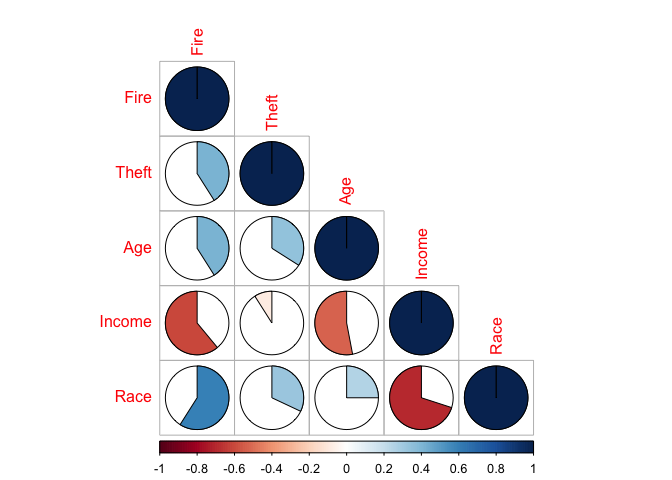
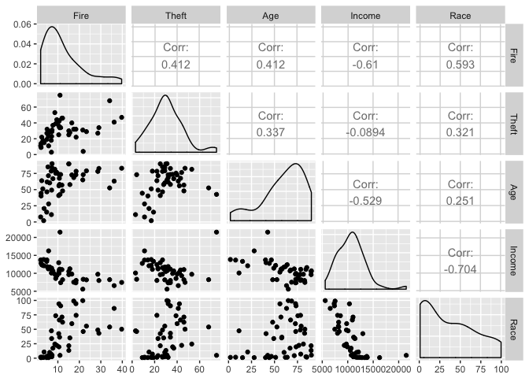
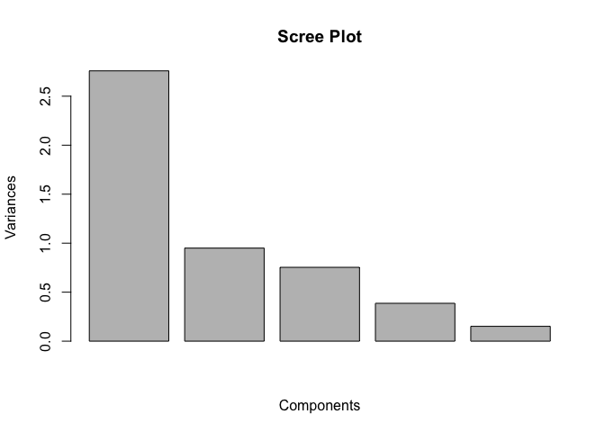
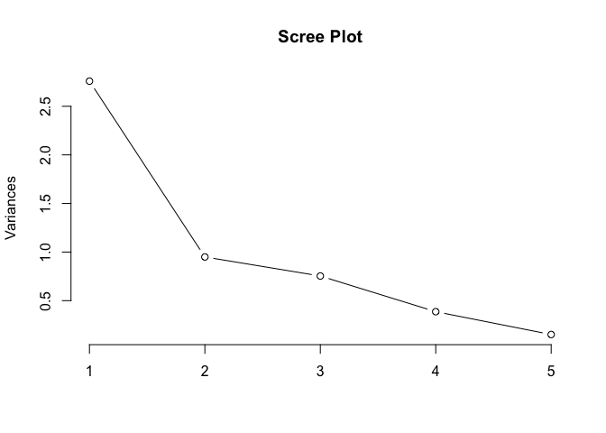
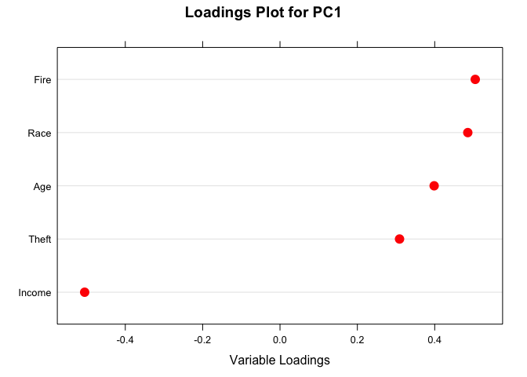
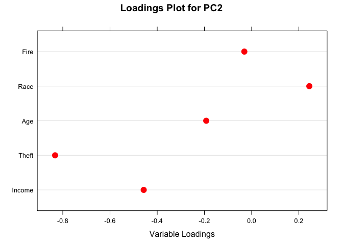
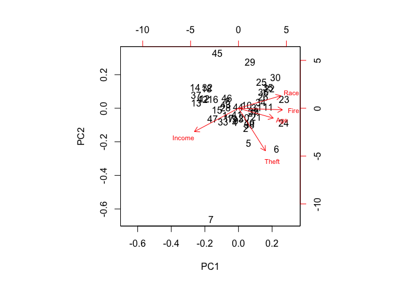
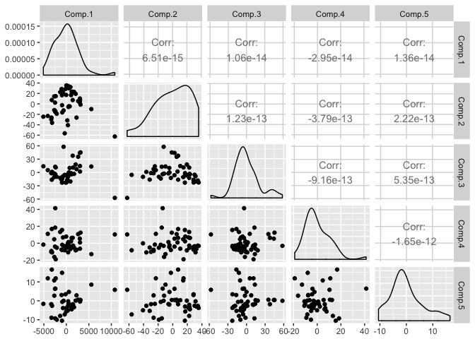
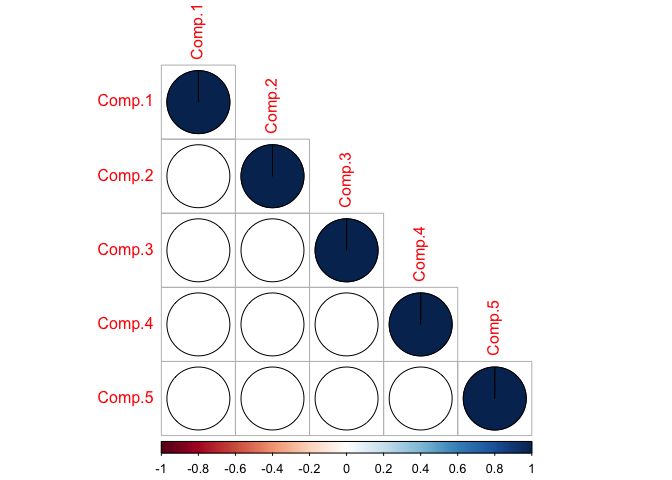

PCA\_using\_R\_functions.Rmd
================
Shravan Kuchkula
10/14/2017

-   [Introduction](#introduction)
-   [Getting the data](#getting-the-data)
-   [Data set description](#data-set-description)
-   [Exploratory Data Analysis](#exploratory-data-analysis)
-   [Doing PCA](#doing-pca)
-   [Varimax rotation](#varimax-rotation)
-   [Additional Things](#additional-things)

Introduction
------------

How to use the `prcomp` and `varimax` functions in R to accomplish a Principal Components Analysis. We cover the following steps:

-   Read in the Data
-   Plot a Correlation Matrix
-   Call prcomp
-   DotPlot the PCA loadings
-   Apply the Kaiser Criterion
-   Make a screeplot
-   Plot the Biplot and
-   Apply the varimax rotation.

Getting the data
----------------

``` r
# Install the required packages and load them.
# install.packages("calibrate")
source("libraries.R")
library(lattice)
library(dplyr)
```

Download the dataset

``` r
insurance <- read.csv("/Users/Shravan/Downloads/Unit8Exercise/Insurance.csv")
glimpse(insurance)
```

    ## Observations: 47
    ## Variables: 9
    ## $ ZIP      <int> 26, 40, 13, 57, 14, 10, 11, 25, 18, 47, 22, 31, 46, 5...
    ## $ Fire     <dbl> 6.2, 9.5, 10.5, 7.7, 8.6, 34.1, 11.0, 6.9, 7.3, 15.1,...
    ## $ Theft    <int> 29, 44, 36, 37, 53, 68, 75, 18, 31, 25, 34, 14, 11, 1...
    ## $ Age      <dbl> 60.4, 76.5, 73.5, 66.9, 81.4, 52.6, 42.6, 78.5, 90.1,...
    ## $ Income   <int> 11744, 9323, 9948, 10656, 9730, 8231, 21480, 11104, 1...
    ## $ Race     <dbl> 10.0, 22.2, 19.6, 17.3, 24.5, 54.0, 4.9, 7.1, 5.3, 21...
    ## $ Vol      <dbl> 5.3, 3.1, 4.8, 5.7, 5.9, 4.0, 17.9, 6.9, 7.6, 3.1, 1....
    ## $ Invol    <dbl> 0.0, 0.1, 1.2, 0.5, 0.7, 0.3, 0.0, 0.0, 0.4, 1.1, 1.9...
    ## $ Location <fctr> North, North, North, North, North, North, North, Nor...

Data set description
--------------------

In the 1970s, the U.S. Commission on Civil Rights investigated charges that insur- ance companies were attempting to redefine Chicago “neighborhoods” in order to cancel existing homeowner insurance policies or refuse to issue new ones. Data on homeowner and residential fire insurance policy issuances from 47 zip codes in the Chicago area form our data set. Six variables describe general zip code features:

-   **fire** - fires per 1,000 housing units
-   **theft** - thefts per 1,000 population
-   **age** - percentage of housing units built prior to 1940
-   **income** - median family income
-   **race** - percentage minority
-   **zip** - the last two digits of the zip code (the first three being 606)

Chicago’s FAIR plan provided a way for households that were rejected by the voluntary insurance market to obtain insurance coverage. These policies were issued involuntarily by the insurance industry.

-   **vol** - is the number of new policies per 100 housing units
-   **invol** - is the number of FAIR plan policies/renewals per 100 housing units.

Lastly, Location is a re-coded variable from the zip variable, dividing the localities into either `North` or `South`.

-   **location** - Derived from the zipcode of the locality as either North or South

Exploratory Data Analysis
-------------------------

Let's create a correlation matrix of all the zip code variables: `{fire, theft, age, income, race}`

``` r
corMatrix <- insurance %>%
                dplyr::select(Fire, Theft, Age, Income, Race)

# Create the correlation matrix
round(cor(corMatrix), 2)
```

    ##         Fire Theft   Age Income  Race
    ## Fire    1.00  0.41  0.41  -0.61  0.59
    ## Theft   0.41  1.00  0.34  -0.09  0.32
    ## Age     0.41  0.34  1.00  -0.53  0.25
    ## Income -0.61 -0.09 -0.53   1.00 -0.70
    ## Race    0.59  0.32  0.25  -0.70  1.00

Visualize this in a corrplot

``` r
M <- round(cor(corMatrix), 2)
corrplot(M, method="pie", type = "lower")
```



Scatter plot of the zip code variables

``` r
corMatrix %>%
  ggpairs()
```



Doing PCA
---------

Next let's call the procedure `prcomp` to do the PCA.

``` r
# running pca on the zip code variables.
my.prc <- prcomp(corMatrix, center = T, scale = T)
```

The name of the procedure is prcomp and underneath the hood it uses a singular value decomposition to accomplish the PCA. The procedure takes the dataset and `center = T` which indicates that we want to center the data and `scale = T` scale it to unit variance.

Now we have the result of the analysis in my.prc. Let's examine this object by calling `ls()` on this object.

``` r
ls(my.prc)
```

    ## [1] "center"   "rotation" "scale"    "sdev"     "x"

So with this object, we can get the centered data, the rotations, the standard deviations and the scores which the prcomp function calls them as x.

Now let's take a summary look at `my.prc` object.

``` r
summary(my.prc)
```

    ## Importance of components:
    ##                           PC1    PC2    PC3     PC4     PC5
    ## Standard deviation     1.6609 0.9745 0.8682 0.62175 0.38912
    ## Proportion of Variance 0.5517 0.1899 0.1507 0.07731 0.03028
    ## Cumulative Proportion  0.5517 0.7417 0.8924 0.96972 1.00000

So, what we see here is that we have five components. The first component accounts for 55% of the variation, second component is 18%, third component is 15% etc.

Now, the first 3 components account for 89% of the variation. At this point, you may have a question of how many of these components to keep ? There is atleast two ways to answer this:

1.  First is using the Keiser Criterion. What this says is that, the `eigen values` associated with each component if that is greater than 1, then you retain that component. **NOTE**: The `eigen value` associated with each component not the `eigen vector`. Now you may be wondering how do we get the eigen value for each component ? We actually have that information on our finger tips in the form of `sdev` standard deviations of the my.prc object. Now, if we square the `sdev` values we get the `eigen values` back. Now the reason this works is because the sum of eigen values is the sum total of the variance in the dataset. The `sdev` is the square root of that, a singular value. So if we square that information we get the eigen values back.

``` r
my.prc$sdev ^ 2
```

    ## [1] 2.7586160 0.9496824 0.7537101 0.3865744 0.1514171

What we see here is that only the first is greater than 1 and the rest are not. So according to Keiser Criterion, we would retain only PC1.

1.  Second way to answer this question is using a plot called the `scree plot`. A bar plot of the principal components. You see that they account for less variation down the line. The idea here is that to retain the components that are contributing significantly.

``` r
screeplot(my.prc, main= "Scree Plot", xlab = "Components")
```



Another way to look at screeplots is by using a line plot instead

``` r
screeplot(my.prc, type = "line", main = "Scree Plot")
```



It is the same plot, instead of bars we have lines. We see that PC4 and PC5 are approaching zero. So using this criteria, I would keep principal components 1 definitely and 2 may be. Let's keep the first two principal components.

The next steps is to take a look at the principal components themselves.

``` r
my.prc$rotation
```

    ##               PC1         PC2        PC3        PC4        PC5
    ## Fire    0.5048229 -0.03090255  0.1890711 -0.8296296  0.1420061
    ## Theft   0.3090776 -0.83261158  0.2407813  0.2183405 -0.3249320
    ## Age     0.3985347 -0.19233538 -0.8163274  0.1235444  0.3500337
    ## Income -0.5050429 -0.45724546  0.1426136 -0.1371460  0.7047769
    ## Race    0.4855169  0.24441088  0.4685589  0.4795518  0.5049944

What we can see here is that each of the PC's are a linear combination of each of the variables. These coefficients are called as `loadings` or `rotations`. And they indicate to what extent that variable is correlated with that specific component. For example, in PC1, Fire and Income are the major contributors. Another concept here is that Income is being contrasted by the other variables, since it has an opposite sign. In PC2, we see that Theft is strongly correlated with principal component and is being contrasted by Race.

There is an easier way to look at these loadings than by inspecting the values. In our case we have 5 variables, but imagine having 100 variables. That becomes tedious. So we have an easy way to visualize this information. In other words, we need a better approach to examine these relationships. Now, ofcourse we can look at the "Bi-plot", but we will get to that momentarily. But one useful techniques is to look at the `dotplot` of the loadings.

``` r
load <- my.prc$rotation
sorted.loadings <- load[order(load[, 1]), 1]
myTitle <- "Loadings Plot for PC1" 
myXlab  <- "Variable Loadings"
dotplot(sorted.loadings, main=myTitle, xlab=myXlab, cex=1.5, col="red")
```



Here we are seeing the loadings for PC1, it is much easier to see relationships amoung variables in this plot. We can see here that Fire, Race and Income are major contributors of PC1.

``` r
load <- my.prc$rotation
sorted.loadings <- load[order(load[, 1]), 2]
myTitle <- "Loadings Plot for PC2" 
myXlab  <- "Variable Loadings"
dotplot(sorted.loadings, main=myTitle, xlab=myXlab, cex=1.5, col="red")
```



In this case, we see that Theft is contributing to the PC2 component. In PC2, the dominant variable relate to Theft.

Of course the premier visualization tool for PCA is the "Bi-Plot". Recall, that the Bi in the Bi-Plot comes from the fact that we are plotting the variables as vectors onto the same graph as the observations as points. I will go ahead and call that function:

``` r
# Now draw the BiPlot
biplot(my.prc, cex=c(1, 0.7))
```



So, here is the "Bi-Plot". Now, we have already done the "dotplots" of the principal components, so we have some idea about the variables and observations. One thing you should recall about the variables is that the cosine of the angle between the vectors is infact the correlation between the variables. So for example, Income is strongly negatively correlated with Race and Fire. We already looked at the correlation and dotplots and knew that this might be the case. So in this component the PC1 we might consider that points towards income are contrasted with points close to Race and Fire. Let's take a look at observation 23 which is close to Race and Fire and observation 13 which is close to Income.

``` r
insurance[c(13, 23),]
```

    ##    ZIP Fire Theft  Age Income Race  Vol Invol Location
    ## 13  46  5.7    11 27.9  16250  1.0 12.1   0.0    North
    ## 23  12 36.2    41 63.1   6565 86.2  0.8   1.8    North

This is what the Bi-Plot shows.

Now when we look at PC2, the observations 45 is contrasted with observation 7. Take a look:

``` r
insurance[c(7,45),]
```

    ##    ZIP Fire Theft  Age Income Race  Vol Invol Location
    ## 7   11   11    75 42.6  21480  4.9 17.9   0.0    North
    ## 45  27    7     3 11.4  10080 47.4  7.7   0.2    South

In PC2, Theft is the major contributor, thus look at the contrast for observations 7 and 45.

Therefore, by looking at the Bi-plot, we would expect to find that points to be of a certain value based on where they are located.

Varimax rotation
----------------

One thing we can do to improve our understanding of Bi-plots and PCA is to apply something called `Varimax Rotation`. What that is, is that it is a change of co-ordinates such that it maximizes the sum of the variance of the squared loadings. It's whole goal is to clean up, if you will, all the rotations that we found when we called prcomp.

Varimax takes as an argument the rotation values returned from prcomp.

``` r
my.var <- varimax(my.prc$rotation)
```

Now, if we take a look at that, what we get is a rotation on top of a rotation.

``` r
my.var
```

    ## $loadings
    ## 
    ## Loadings:
    ##        PC1 PC2 PC3 PC4 PC5
    ## Fire               -1     
    ## Theft      -1             
    ## Age            -1         
    ## Income                  1 
    ## Race    1                 
    ## 
    ##                PC1 PC2 PC3 PC4 PC5
    ## SS loadings    1.0 1.0 1.0 1.0 1.0
    ## Proportion Var 0.2 0.2 0.2 0.2 0.2
    ## Cumulative Var 0.2 0.4 0.6 0.8 1.0
    ## 
    ## $rotmat
    ##           [,1]       [,2]       [,3]        [,4]       [,5]
    ## [1,] 0.4855377 -0.3090863 -0.3985350 -0.50481432 -0.5050259
    ## [2,] 0.2444596  0.8325943  0.1923584  0.03091725 -0.4572403
    ## [3,] 0.4685537 -0.2408082  0.8163166 -0.18906620  0.1426533
    ## [4,] 0.4795308 -0.2183660 -0.1235456  0.82963829 -0.1371254
    ## [5,] 0.5049755  0.3249310 -0.3500454 -0.14198911  0.7047885

Now, what we are seeing here in the loadings is that, for each Factor (that is PC column in loadings section) high correlation were resolved for few of these variables and the rest will be near-zero. So the blanks suggest that these variables are more or less towards zero after the varimax rotation, leaving us to consider that Race is the primary contributor of PC1 and Theft is the primary contributor in PC2.

So we refine our understanding of what is going on in PC1, that Race is the dominant contributor and not Fire or Income, which we originally thought are the primary contributors (by looking at the dot plots for the PC1). With regards to PC2, Theft is still the dominant contributor, which is consistent with what we found looking at the dotplot for PC2.

The Varimax rotation is a tweak and is part of the base R package, so you can use it whenever you do principal components analysis.

Additional Things
-----------------

> The sum of the eigen values is equal to the total variance in the dataset.

So, lets verify this. As we saw in our previous article, we can calculate the covariance matrix of the dataset using the `cov` function

``` r
(my.cov <- cov(corMatrix))
```

    ##                Fire       Theft          Age      Income        Race
    ## Fire       86.53215    55.72248     86.56604  -15639.852    179.6992
    ## Theft      55.72248   211.22664    110.54991   -3579.785    152.2057
    ## Age        86.56604   110.54991    509.62900  -32870.515    184.2926
    ## Income -15639.85153 -3579.78538 -32870.51475 7585606.666 -63161.9526
    ## Race      179.69924   152.20574    184.29259  -63161.953   1061.9526

Convert this into a correlation matrix using the `cov2cor()` function

``` r
(my.cor <- cov2cor(my.cov))
```

    ##              Fire       Theft        Age      Income       Race
    ## Fire    1.0000000  0.41216143  0.4122225 -0.61044807  0.5927956
    ## Theft   0.4121614  1.00000000  0.3369434 -0.08943088  0.3213691
    ## Age     0.4122225  0.33694341  1.0000000 -0.52866953  0.2505118
    ## Income -0.6104481 -0.08943088 -0.5286695  1.00000000 -0.7037328
    ## Race    0.5927956  0.32136909  0.2505118 -0.70373285  1.0000000

> Calculate the eigen values from both the "my.cov" matrix and "my.cor" matrix

Eigen values from the `my.cov` matrix:

``` r
(my.cov.eigen <- eigen(my.cov))
```

    ## $values
    ## [1] 7.586309e+06 5.975363e+02 4.137852e+02 1.157325e+02 3.995145e+01
    ## 
    ## $vectors
    ##               [,1]         [,2]         [,3]         [,4]         [,5]
    ## [1,] -0.0020617673 -0.097740929 -0.123122260 -0.209894627  0.965001355
    ## [2,] -0.0004721111 -0.243966789 -0.485518217 -0.798134174 -0.260257343
    ## [3,] -0.0043331964  0.252841469 -0.860436215  0.442219199  0.012004758
    ## [4,]  0.9999537066 -0.006974434 -0.004990079  0.004031319  0.001670201
    ## [5,] -0.0083267254 -0.931101211 -0.093475068  0.351215055 -0.029859620

Eigen values from the `my.cor` matrix:

``` r
(my.cor.eigen <- eigen(my.cor))
```

    ## $values
    ## [1] 2.7586160 0.9496824 0.7537101 0.3865744 0.1514171
    ## 
    ## $vectors
    ##            [,1]        [,2]       [,3]       [,4]       [,5]
    ## [1,] -0.5048229 -0.03090255  0.1890711  0.8296296 -0.1420061
    ## [2,] -0.3090776 -0.83261158  0.2407813 -0.2183405  0.3249320
    ## [3,] -0.3985347 -0.19233538 -0.8163274 -0.1235444 -0.3500337
    ## [4,]  0.5050429 -0.45724546  0.1426136  0.1371460 -0.7047769
    ## [5,] -0.4855169  0.24441088  0.4685589 -0.4795518 -0.5049944

Compare this with the loadings we got from running the prcomp function. The Eigen values are the same and the sum of the Eigen values calculated using the `my.cor` matrix is equal to the total sum of variance in the dataset (which is 5).

``` r
sum(my.cor.eigen$values)
```

    ## [1] 5

> Use covariance matrix instead of correlation matrix to do the PCA.

``` r
# Call princomp with scores = TRUE to get the scores.
my.pca.cov <- princomp(corMatrix, scores=TRUE)

# print the scores. This is equivalent in sas to out=pca.
my.pca.cov$scores
```

    ##             Comp.1     Comp.2       Comp.3      Comp.4        Comp.5
    ##  [1,]  1048.342536  16.866765  -1.60963599   2.2568241  -3.047238254
    ##  [2,] -1372.730624  22.481135 -12.21114960  13.2767588  -7.981161960
    ##  [3,]  -747.723193  21.638446  -8.74458187   6.8218225  -3.848605330
    ##  [4,]   -39.702918  17.203034  -6.52446223   7.9045195  -5.638918245
    ##  [5,]  -965.792243  16.632197 -22.93209591  15.6556457 -10.522061158
    ##  [6,] -2464.903348 -13.814342  -3.85130943  41.3979869   6.451385710
    ##  [7,] 10783.979806 -62.479913 -57.32538544  10.3922699   5.812609413
    ##  [8,]   408.321630  31.222243  -8.46428823 -10.7813255  -0.273956322
    ##  [9,]    -1.701629  35.480039 -22.59214642  -3.1663383  -3.763081248
    ## [10,] -1064.799261  28.435592 -16.59110168  -7.5896916   3.062722157
    ## [11,] -2700.905730  14.374731 -10.43067187   4.6807893  10.767774182
    ## [12,]  3026.427934  10.301204  14.50798910  -6.4700736   0.323529085
    ## [13,]  5554.359236  -9.957197  13.51140832 -12.8466010   8.559402104
    ## [14,]  2990.567262   2.527724  44.07690302   5.4000674   0.443103177
    ## [15,]  1709.378081  23.006985  -3.19419108  -5.3247657  -3.400301840
    ## [16,]  1502.444424  22.528964  11.05562911  -2.7689229  -2.110520104
    ## [17,]   904.313045  32.317424 -20.30780929  -6.9697009  -2.997867220
    ## [18,]  2069.457231  19.350615  18.10660149  -8.4249716   0.079839130
    ## [19,]   388.330348  34.373037 -18.21662482  -2.7633150  -2.674909340
    ## [20,]  -185.774867  28.627150 -22.64782442  -4.2977079   3.471405280
    ## [21,]  -912.061128 -16.412601 -13.67636405  -1.8302066  -0.583500106
    ## [22,] -3354.237191 -29.780541  -1.24670154 -10.2124846  -1.777312188
    ## [23,] -4131.131425 -23.139712   5.26812036  11.0528935  11.886851702
    ## [24,] -3236.969329   7.370439 -16.29462599  16.8159108  16.509813329
    ## [25,] -2682.118985 -11.863878  -2.51532408 -16.1753226   2.712126648
    ## [26,] -2518.987055   2.410947  -6.17264296  -3.9798261   6.361352779
    ## [27,] -2483.896109 -15.065243  12.80344388  18.4380612  -9.291272971
    ## [28,]   534.368931  29.994777  -5.08513418  -3.5276487  -2.622711773
    ## [29,] -2365.876239  14.757116  11.33240553 -18.9894208  11.882691507
    ## [30,] -5113.171786 -24.513600  13.92440318  -1.6157745  -1.620028123
    ## [31,] -2132.114490 -19.000183  -9.78331834  -5.2899797  -9.975062419
    ## [32,]  1406.503699   7.375286  37.72913012   6.3600373  -1.810997085
    ## [33,]  1180.402193  23.599867  -3.98720702   6.2334401  -4.494931911
    ## [34,]  -954.009799  -2.523315 -12.26295306  -8.0215285  14.799494806
    ## [35,] -3176.262207 -36.201423   1.26742452 -10.8188792  -2.631006467
    ## [36,] -3308.196151 -26.230733  -1.64812643  -9.1784012  -8.953038300
    ## [37,]  3146.581519  -1.322792  45.14549913  12.4798531   0.433643177
    ## [38,]   343.860485 -40.770847  -9.84741775  -0.1312633  -5.015151972
    ## [39,]  -364.287879 -56.320587  -5.39409679  -8.3198624  -7.204617525
    ## [40,]   211.867454 -31.597581 -16.14228334  -5.0975101  -5.334514112
    ## [41,]   460.148486  -5.889601  -2.07211771   1.3726743  -1.708702469
    ## [42,]  2627.547847   5.382116  35.27157467  10.7654209   0.567702587
    ## [43,]  2264.093784 -26.265273   7.57399707  -7.7032317   2.872030645
    ## [44,]   564.148299  -4.460435   0.02464132  -2.2828703   4.694965578
    ## [45,]  -615.668900 -12.475250  57.88423882  -3.0853367   0.007255889
    ## [46,]   732.206832  -4.731733  10.16301232  -4.5454854  -1.996060749
    ## [47,]  3035.371428   6.558948   2.12516955   0.9034713  -0.422169691

Next calculate the summary statistics of these 5 principal component scores:

Calculate the variance for each principal component

``` r
# variance of the principal components
var(my.pca.cov$scores[,1])
```

    ## [1] 7586309

``` r
var(my.pca.cov$scores[,2])
```

    ## [1] 597.5363

``` r
var(my.pca.cov$scores[,3])
```

    ## [1] 413.7852

``` r
var(my.pca.cov$scores[,4])
```

    ## [1] 115.7325

``` r
var(my.pca.cov$scores[,5])
```

    ## [1] 39.95145

``` r
round(my.cov.eigen$values, 4)
```

    ## [1] 7586309.0010     597.5363     413.7852     115.7325      39.9515

> Hence, the variance of the principal components are their eigen values. Sum of the variances of the principal components is equal to the total variance in the dataset.

``` r
sum(var(my.pca.cov$scores[,1]),
var(my.pca.cov$scores[,2]),
var(my.pca.cov$scores[,3]),
var(my.pca.cov$scores[,4]),
var(my.pca.cov$scores[,5]))
```

    ## [1] 7587476

> Compare the scatterplot matrices for original data and the scores data.

``` r
data.frame(my.pca.cov$scores) %>%
  ggpairs()
```



Visualize the corrplot

``` r
M1 <- round(cor(data.frame(my.pca.cov$scores)), 2)
corrplot(M1, method="pie", type = "lower")
```


