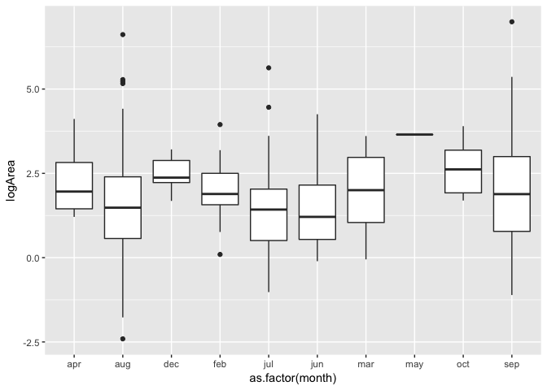
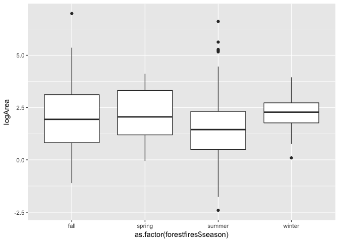
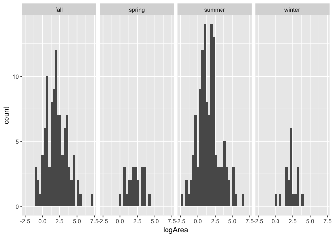
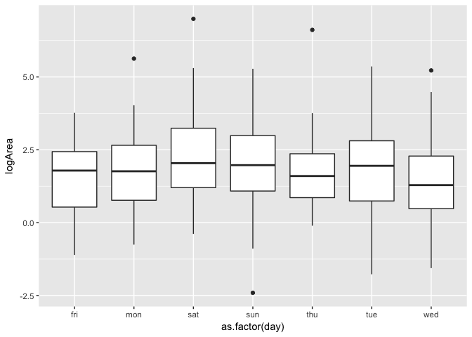
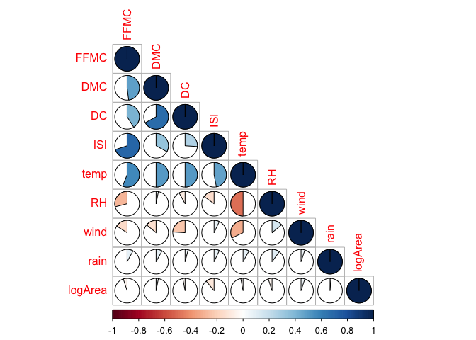
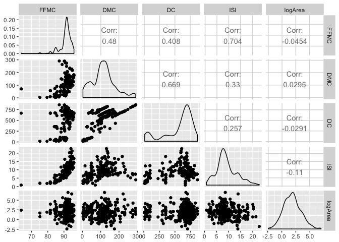
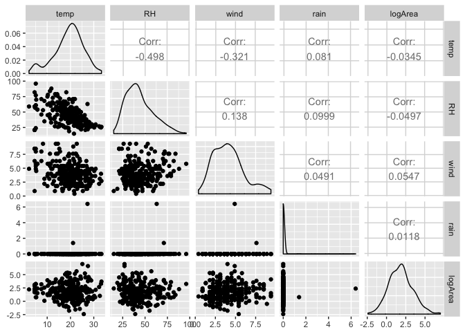

Regression Project - Analysis of Forest Fires
================
Shravan Kuchkula
9/20/2017

-   [Introduction](#introduction)
-   [Data gathering and cleaning](#data-gathering-and-cleaning)
-   [Exploratory Data Analysis](#exploratory-data-analysis)

Introduction
------------

Our main aim is to understand how the burned area of forest fires, in the northeast region of Portugal, is related to the meteorological and other data. The [*forest fires*](http://archive.ics.uci.edu/ml/datasets/Forest+Fires) data set is used to perform this analysis. The data set contains 13 attributes. A brief description of the variables is given here:

-   **X** - x-axis spatial coordinate within the Montesinho park map: 1 to 9.
-   **Y** - y-axis spatial coordinate within the Montesinho park map: 2 to 9.
-   **month** - month of the year: 'jan' to 'dec'.
-   **day** - day of the week: 'mon' to 'sun'.
-   **FFMC** - FFMC index from the FWI system.
-   **DMC** - DMC index from the FWI system.
-   **DC** - DC index from the FWI system.
-   **ISI** - ISI index from the FWI system.
-   **temp** - temperature in Celsius degrees.
-   **RH** - relative humidity in %.
-   **wind** - wind speed in km/h.
-   **rain** - outside rain in mm/m2.
-   **area** - the burned area of the forest (in ha).

Data gathering and cleaning
---------------------------

All the required libraries are loaded.

``` r
source('libraries.R')
source('Main.R')
```

The data is retrieved and stored into a data frame using `read.csv`.

``` r
forestfires <- read.csv("http://archive.ics.uci.edu/ml/machine-learning-databases/forest-fires/forestfires.csv")
```

Exploratory Data Analysis
-------------------------

The response variable in our analysis is the `area`. A histogram of `area` reveals that a large number of values are zeros. A zero value for area indicates that there were no forest fires.

``` r
#attach(forestfires)
hist(forestfires$area, 40)
```


A log transformation can reveal the distribution of the area variable. However, since we have zeros, the log transform should be done on area + 1, i.e, log(area + 1). The distribution of log(area + 1) is shown:

``` r
#attach(forestfires)
hist(log(forestfires$area + 1), 40)
```


Even this log(area + 1) transformation does not help much as large number of values are zeros. A quick check reveals that 47.77 % of the time, there has been no forest fire.

``` r
sum(forestfires$area == 0)/nrow(forestfires)
```

    ## [1] 0.4777563

Since our aim is to predict the area of the forest fires given that there is indeed a forest fire going on, and not to predict whether there will be a forest fire or not, we can remove the observations with area = 0 from our analysis.

The histogram for log(area\[area &gt;0\]) is shown here:

``` r
#attach(forestfires)
forestfires <- forestfires %>%
  filter(area > 0) %>%
  mutate(logArea=log(area))
hist(forestfires$logArea, 40)
```


Next, we will see how the transformed response variable correlates with other variables. X, Y, month and day are categrorical variables. A better way to explore the relationship of these categorical variables with the log(area\[area&gt;0\]) is to draw a box plot.

``` r
ggplot(forestfires, aes(x = as.factor(X), y=logArea)) +
geom_boxplot()
```


The box plot reveals that the mean and variation is pretty much the same across all levels of X, which indicates that X may not be a great predictor of logArea.

``` r
#attach(forestfires)
ggplot(forestfires, aes(x = as.factor(Y), y=logArea)) +
  geom_boxplot()
```


Same goes with Y. Thus, both the spatial predictors X and Y can safely be ignored from the model. Keeping these discrete variables does not appear to be a good choice.

Next, let's explore how the `month` and `day` categorical variables are related to logArea - our transformed response variable.

``` r
ggplot(forestfires, aes(x = as.factor(month), y=logArea)) +
  geom_boxplot()
```



There is definitely some variability of `logArea` between each of these `months (groups)`. However, some months don't have much data in them. It is better to even out these observations by categorizing them into seasons. Recoding the month variable into season.

``` r
for (i in 1:270){
  if(forestfires$month[i] %in% c("dec", "jan", "feb"))
      forestfires$season[i] <- "winter"
  else if (forestfires$month[i] %in% c("sep", "oct", "nov"))
      forestfires$season[i] <- "fall"
  else if (forestfires$month[i] %in% c("jun", "jul", "aug"))
      forestfires$season[i] <- "summer"
  else
      forestfires$season[i] <- "spring"
}

forestfires %>%
  ggplot(aes(x = as.factor(forestfires$season), y=logArea)) +
    geom_boxplot()
```



It may not be very obvious from this boxplot, but summer months tend to have a higher values of area burnt by forest fires and also most frequent forest fires occur in summer months. A quick look at the contingency table reveals this fact. Also notice that a large number of values greater than 5 are in the summer months.

``` r
table(as.factor(forestfires$season))
```

    ## 
    ##   fall spring summer winter 
    ##    102     24    125     19

This can be visually verified by this plot:

``` r
# Create a histogram to check the distribution of values faceted by season.
ggplot(forestfires, aes(x = logArea)) +
  geom_histogram() + 
  facet_grid(~as.factor(season))
```



This shows that summer and fall seasons tend to be associated with higher values of logArea. Hence, we should consider to include `season` as a predictor in our model.

The last categorical variable that we need to investigate is the `day` variable.

``` r
forestfires %>%
  ggplot(aes(x = as.factor(day), y=logArea)) +
  geom_boxplot()
```



Saturday and Sunday appear to have more severe forestfires than the rest of the days. This can be attributed to human involvement, hence this factor should be considered in the model.

Next, we explore the relationship of numeric variables versus the response variable. Create a correlation matrix of all the numeric variables:

``` r
numericFF <- forestfires %>%
  select(-X, -Y, -month, -day, -area, -season)

# Create correlation matrix
round(cor(numericFF), 2)
```

    ##          FFMC   DMC    DC   ISI  temp    RH  wind rain logArea
    ## FFMC     1.00  0.48  0.41  0.70  0.56 -0.29 -0.16 0.08   -0.05
    ## DMC      0.48  1.00  0.67  0.33  0.50  0.03 -0.14 0.08    0.03
    ## DC       0.41  0.67  1.00  0.26  0.50 -0.08 -0.24 0.04   -0.03
    ## ISI      0.70  0.33  0.26  1.00  0.47 -0.15  0.07 0.07   -0.11
    ## temp     0.56  0.50  0.50  0.47  1.00 -0.50 -0.32 0.08   -0.03
    ## RH      -0.29  0.03 -0.08 -0.15 -0.50  1.00  0.14 0.10   -0.05
    ## wind    -0.16 -0.14 -0.24  0.07 -0.32  0.14  1.00 0.05    0.05
    ## rain     0.08  0.08  0.04  0.07  0.08  0.10  0.05 1.00    0.01
    ## logArea -0.05  0.03 -0.03 -0.11 -0.03 -0.05  0.05 0.01    1.00

Visualize this in a corrplot

``` r
# Create correlation matrix
M <- round(cor(numericFF), 2)
corrplot(M, method="pie", type="lower")
```



There appear to be some correlation between predictor variables. Very little correlation with the response variable.

Scatter plot of only numeric variables

``` r
numericFF %>%
  select(-temp, -RH, -wind, -rain) %>%
  ggpairs()
```



``` r
numericFF %>%
  select(-FFMC, -DMC, -DC, -ISI) %>%
  ggpairs()
```


