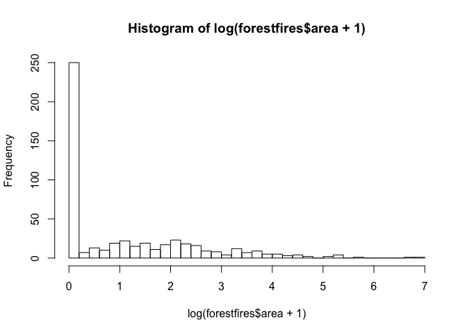
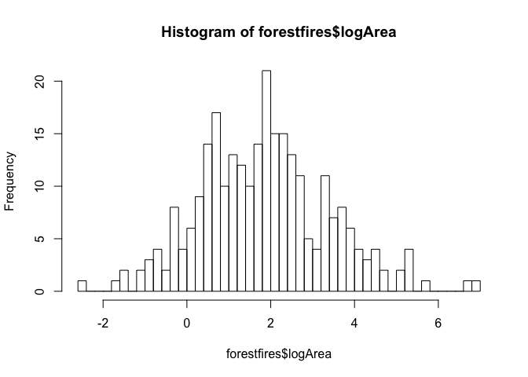

Regression Project - Analysis of Forest Fires
================
Shravan Kuchkula
9/20/2017

-   [Introduction](#introduction)
-   [Data gathering and cleaning](#data-gathering-and-cleaning)
-   [Exploratory Data Analysis](#exploratory-data-analysis)

Introduction
------------

Our main aim is to understand how the burned area of forest fires, in the northeast region of Portugal, is related to the meteorological and other data. The [*forest fires*](http://archive.ics.uci.edu/ml/datasets/Forest+Fires) data set is used to perform this analysis. The data set contains 13 attributes. A brief description of the variables is given here:

-   **X** - x-axis spatial coordinate within the Montesinho park map: 1 to 9.
-   **Y** - y-axis spatial coordinate within the Montesinho park map: 2 to 9.
-   **month** - month of the year: 'jan' to 'dec'.
-   **day** - day of the week: 'mon' to 'sun'.
-   **FFMC** - FFMC index from the FWI system.
-   **DMC** - DMC index from the FWI system.
-   **DC** - DC index from the FWI system.
-   **ISI** - ISI index from the FWI system.
-   **temp** - temperature in Celsius degrees.
-   **RH** - relative humidity in %.
-   **wind** - wind speed in km/h.
-   **rain** - outside rain in mm/m2.
-   **area** - the burned area of the forest (in ha).

Data gathering and cleaning
---------------------------

All the required libraries are loaded.

``` r
source('libraries.R')
```

The data is retrieved and stored into a data frame using `read.csv`.

``` r
forestfires <- read.csv("http://archive.ics.uci.edu/ml/machine-learning-databases/forest-fires/forestfires.csv",
                        stringsAsFactors = FALSE)
```

Exploratory Data Analysis
-------------------------

The response variable in our analysis is the `area`. A histogram of `area` reveals that a large number of values are zeros. A zero value for area indicates that there were no forest fires.

``` r
attach(forestfires)
hist(area, 40)
```


A log transformation can reveal the distribution of the area variable. However, since we have zeros, the log transform should be done on area + 1, i.e, log(area + 1). The distribution of log(area + 1) is shown:

``` r
attach(forestfires)
hist(log(area + 1), 40)
```



Even this log(area + 1) transformation does not help much as large number of values are zeros. A quick check reveals that 47.77 % of the time, there has been no forest fire.

``` r
sum(forestfires$area == 0)/nrow(forestfires)
```

    ## [1] 0.4777563

Since our aim is to predict the area of the forest fires given that there is indeed a forest fire going on, and not to predict whether there will be a forest fire or not, we can remove the observations with area = 0 from our analysis.

The histogram for log(area\[area &gt;0\]) is shown here:

``` r
attach(forestfires)
hist(log(area[area>0]), 40)
```



Next, we will see how the transformed response variable correlates with other variables. X, Y, month and day are categrorical variables. A better way to explore the relationship of these categorical variables with the log(area\[area&gt;0\]) is to draw a box plot.

``` r
attach(forestfires)
forestfires %>%
  filter(area > 0) %>%
  mutate(logArea = log(area)) %>%
  ggplot(aes(x = as.factor(X), y=logArea)) +
  geom_boxplot()
```


The box plot reveals that the mean and variation is pretty much the same across all levels of X, which indicates that X may not be a great predictor of logArea.

``` r
attach(forestfires)
forestfires %>%
  filter(area > 0) %>%
  mutate(logArea = log(area)) %>%
  ggplot(aes(x = as.factor(Y), y=logArea)) +
  geom_boxplot()
```


