Regression Project - Analysis of Forest Fires
================
Shravan Kuchkula
9/20/2017

-   [Introduction](#introduction)
-   [Data gathering and cleaning](#data-gathering-and-cleaning)
-   [Exploratory Data Analysis](#exploratory-data-analysis)
-   [Simple linear regression](#simple-linear-regression)
    -   [Assessing Model Fit:](#assessing-model-fit)
    -   [Comparing Model fits:](#comparing-model-fits)
    -   [Calculating high-leverage points:](#calculating-high-leverage-points)
    -   [Influence:](#influence)
-   [Multiple Linear Regression](#multiple-linear-regression)
    -   [Fitting a parallel slopes model](#fitting-a-parallel-slopes-model)
    -   [Checking the predictors](#checking-the-predictors)
    -   [Interactions](#interactions)
    -   [Squared Terms](#squared-terms)
-   [Model Selection](#model-selection)
-   [Model Checking](#model-checking)
-   [Interpretation of coefficients](#interpretation-of-coefficients)
-   [Conclusion](#conclusion)

Introduction
------------

Our main aim is to understand how the burned area of forest fires, in the northeast region of Portugal, is related to the meteorological and other data. The [*forest fires*](http://archive.ics.uci.edu/ml/datasets/Forest+Fires) data set is used to perform this analysis. The data set contains 13 attributes. A brief description of the variables is given here:

-   **X** - x-axis spatial coordinate within the Montesinho park map: 1 to 9.
-   **Y** - y-axis spatial coordinate within the Montesinho park map: 2 to 9.
-   **month** - month of the year: 'jan' to 'dec'.
-   **day** - day of the week: 'mon' to 'sun'.
-   **FFMC** - FFMC index from the FWI system.
-   **DMC** - DMC index from the FWI system.
-   **DC** - DC index from the FWI system.
-   **ISI** - ISI index from the FWI system.
-   **temp** - temperature in Celsius degrees.
-   **RH** - relative humidity in %.
-   **wind** - wind speed in km/h.
-   **rain** - outside rain in mm/m2.
-   **area** - the burned area of the forest (in ha).

Data gathering and cleaning
---------------------------

All the required libraries are loaded.

``` r
source('libraries.R')
source('Main.R')
```

The data is retrieved and stored into a data frame using `read.csv`.

``` r
ff <- read.csv("http://archive.ics.uci.edu/ml/machine-learning-databases/forest-fires/forestfires.csv")
```

Exploratory Data Analysis
-------------------------

The response variable in our analysis is the `area`. A histogram of `area` reveals that a large number of values are zeros. A zero value for area indicates that there were no forest fires.

``` r
hist(ff$area, 40)
```

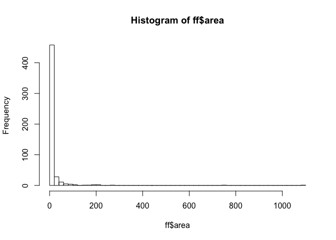

A log transformation can reveal the distribution of the area variable. However, since we have zeros, the log transform should be done on area + 1, i.e, log(area + 1). The distribution of log(area + 1) is shown:

``` r
ff <- ff %>%
  mutate(logArea = log((area + 1)))
hist(ff$logArea, 40)
```

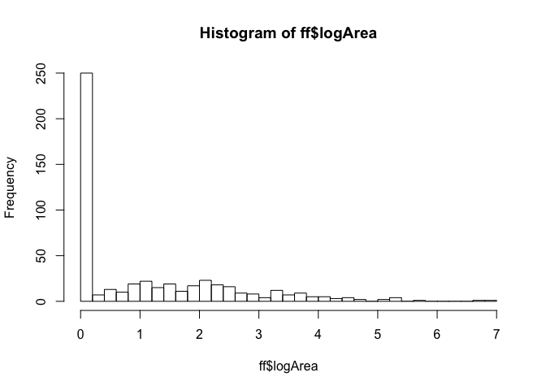

Since we are not interested in predicting whether or not there is a forest fire, but we are interested in answering how much area is burnt due to a forest fire, we will remove the observations which have zeros.

``` r
ff <- ff %>%
  filter(logArea > 0) 
hist(ff$logArea, 40)
```

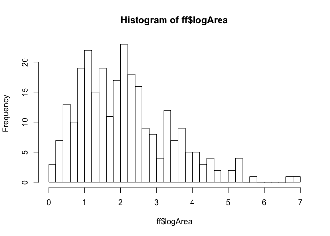

Note here that all values are positive which helps in interpretation.

Next, we will see how the transformed response variable correlates with other variables. X, Y, month and day are categrorical variables. A better way to explore the relationship of these categorical variables with the logArea is to draw a box plot.

``` r
ggplot(ff, aes(x = as.factor(X), y=logArea)) +
geom_boxplot()
```

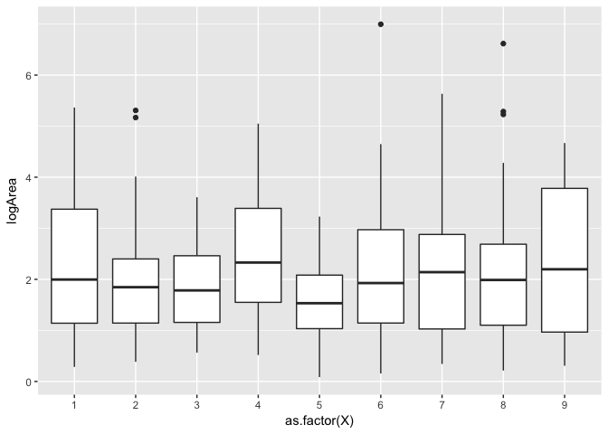 The box plot reveals that the mean and variation is pretty much the same across all levels of X, which indicates that X may not be a great predictor of logArea.

``` r
#attach(forestfires)
ggplot(ff, aes(x = as.factor(Y), y=logArea)) +
  geom_boxplot()
```

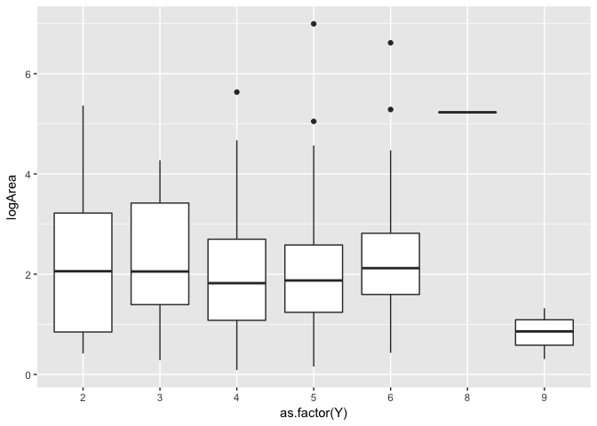

Same goes with Y. Thus, both the spatial predictors X and Y can safely be ignored from the model. Keeping these discrete variables does not appear to be a good choice.

Next, let's explore how the `month` and `day` categorical variables are related to logArea - our transformed response variable.

``` r
ggplot(ff, aes(x = as.factor(month), y=logArea)) +
  geom_boxplot()
```

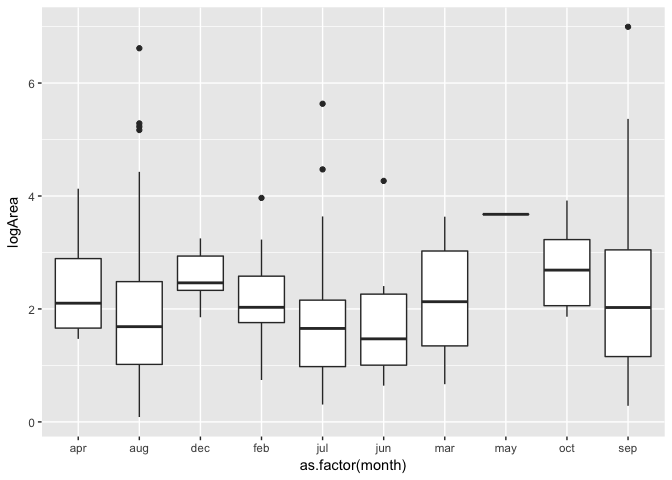

There is definitely some variability of `logArea` between each of these `months (groups)`. However, some months don't have much data in them. It is better to even out these observations by categorizing them into seasons. Recoding the month variable into season.

``` r
for (i in 1:270){
  if(ff$month[i] %in% c("dec", "jan", "feb"))
      ff$season[i] <- "winter"
  else if (ff$month[i] %in% c("sep", "oct", "nov"))
      ff$season[i] <- "fall"
  else if (ff$month[i] %in% c("jun", "jul", "aug"))
      ff$season[i] <- "summer"
  else
      ff$season[i] <- "spring"
}

ff %>%
  ggplot(aes(x = as.factor(ff$season), y=logArea)) +
    geom_boxplot()
```

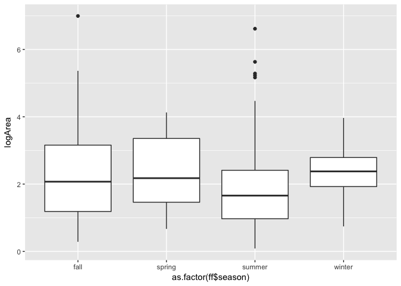

It may not be very obvious from this boxplot, but summer months tend to have a higher values of area burnt by forest fires and also most frequent forest fires occur in summer months. A quick look at the contingency table reveals this fact. Also notice that a large number of values greater than 5 are in the summer months.

``` r
table(as.factor(ff$season))
```

    ## 
    ##   fall spring summer winter 
    ##    102     24    125     19

This can be visually verified by this plot:

``` r
# Create a histogram to check the distribution of values faceted by season.
ggplot(ff, aes(x = logArea)) +
  geom_histogram() + 
  facet_grid(~as.factor(season))
```

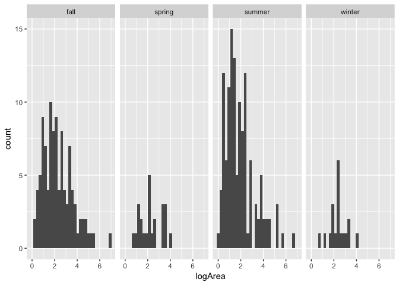

This shows that summer and fall seasons tend to be associated with higher values of logArea. Hence, we should consider to include `season` as a predictor in our model.

The last categorical variable that we need to investigate is the `day` variable.

``` r
ff %>%
  ggplot(aes(x = as.factor(day), y=logArea)) +
  geom_boxplot()
```

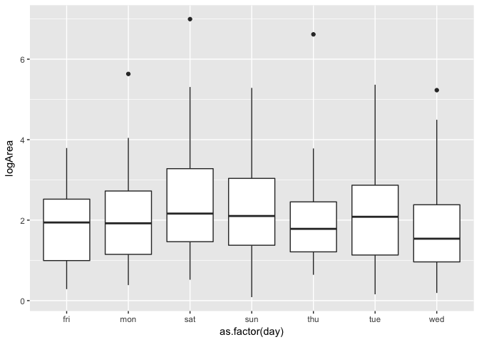

Saturday and Sunday appear to have more severe forestfires than the rest of the days. This can be attributed to human involvement, hence this factor should be considered in the model.

Next, we explore the relationship of numeric variables versus the response variable. Create a correlation matrix of all the numeric variables:

``` r
numericFF <- ff %>%
  select(-X, -Y, -month, -day, -area, -season)

# Create correlation matrix
round(cor(numericFF), 2)
```

    ##          FFMC   DMC    DC   ISI  temp    RH  wind rain logArea
    ## FFMC     1.00  0.48  0.41  0.70  0.56 -0.29 -0.16 0.08   -0.03
    ## DMC      0.48  1.00  0.67  0.33  0.50  0.03 -0.14 0.08    0.04
    ## DC       0.41  0.67  1.00  0.26  0.50 -0.08 -0.24 0.04   -0.02
    ## ISI      0.70  0.33  0.26  1.00  0.47 -0.15  0.07 0.07   -0.09
    ## temp     0.56  0.50  0.50  0.47  1.00 -0.50 -0.32 0.08   -0.01
    ## RH      -0.29  0.03 -0.08 -0.15 -0.50  1.00  0.14 0.10   -0.06
    ## wind    -0.16 -0.14 -0.24  0.07 -0.32  0.14  1.00 0.05    0.05
    ## rain     0.08  0.08  0.04  0.07  0.08  0.10  0.05 1.00    0.01
    ## logArea -0.03  0.04 -0.02 -0.09 -0.01 -0.06  0.05 0.01    1.00

Visualize this in a corrplot

``` r
# Create correlation matrix
M <- round(cor(numericFF), 2)
corrplot(M, method="pie", type="lower")
```

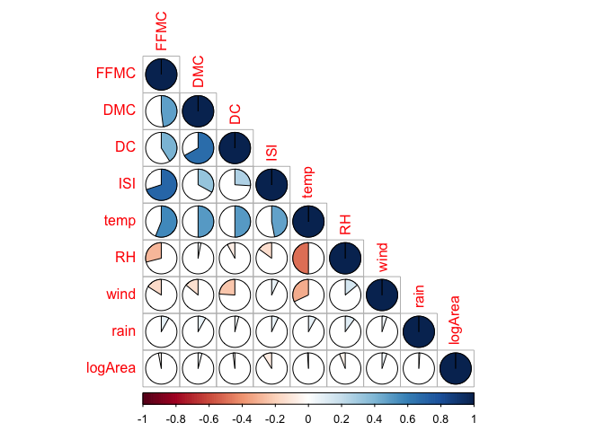

There appear to be some correlation between predictor variables. Very little correlation with the response variable.

Scatter plot of only numeric variables

``` r
numericFF %>%
  select(-temp, -RH, -wind, -rain) %>%
  ggpairs()
```

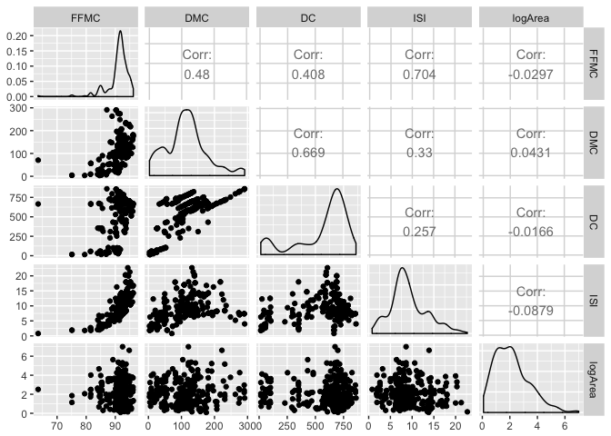

``` r
numericFF %>%
  select(-FFMC, -DMC, -DC, -ISI) %>%
  ggpairs()
```

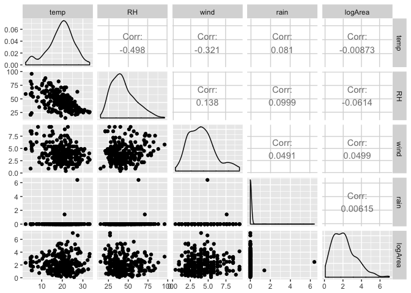

Simple linear regression
------------------------

Let's start by building a linear model with the numeric predictors. We will start with something very simple, lets take FFMC as the predictor of logArea

A scatterplot showing the regression line is shown below

``` r
p <- ff %>%
  ggplot(aes(y=logArea, x=FFMC)) + 
  geom_point()
```

There are `2 ways` with which you can draw an abline in R:

1.  Using lm and coef, then using the intercept and slope in abline
2.  Using geom\_smooth(method = "lm")

``` r
coef(lm(logArea~FFMC, data=ff))
```

    ## (Intercept)        FFMC 
    ##  3.04390590 -0.01006763

Next, pass these to geom\_abline()

``` r
p + geom_abline(intercept = 3.044, slope = -0.01)
```

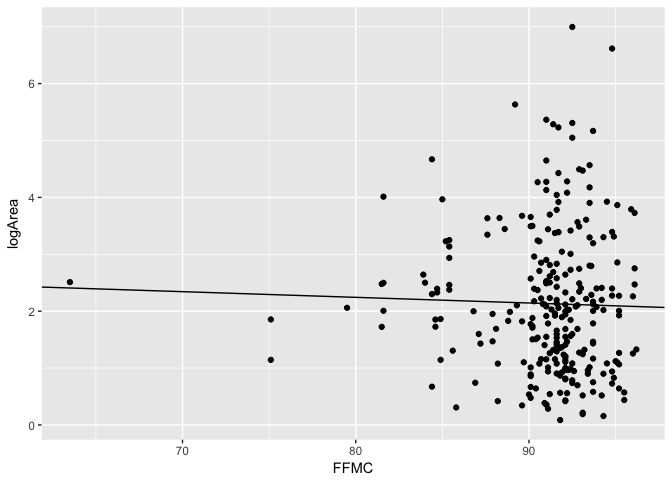

Instead of using these 2 steps it is possible to get this result using geom\_smooth in 1 step:

``` r
p + geom_smooth(method = "lm", se = FALSE)
```

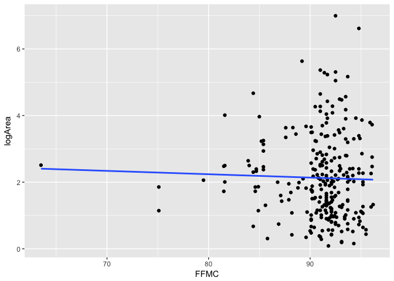

When you draw a regression line, it might also help to see the no-affect line (i.e mean of logArea)

``` r
p + geom_abline(intercept = mean(ff$logArea), slope=0) + geom_smooth(method = "lm", se = FALSE)
```

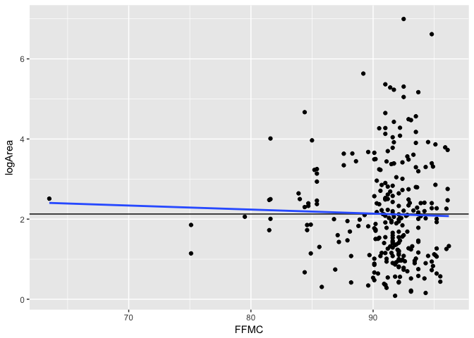

Let's take a detour to understand SLR with logArea ~ FFMC and get an understanding of the lm object.

``` r
mod <- lm(logArea ~ FFMC, data=ff)
```

When you display the `mod` object, you see the call and the fitted coefficients

``` r
mod
```

    ## 
    ## Call:
    ## lm(formula = logArea ~ FFMC, data = ff)
    ## 
    ## Coefficients:
    ## (Intercept)         FFMC  
    ##     3.04391     -0.01007

When you only want to see the fitted coefficients, then you can use `coef` function to get these

``` r
coef(mod)
```

    ## (Intercept)        FFMC 
    ##  3.04390590 -0.01006763

The `summary` function displays a summary of the regression model.

``` r
summary(mod)
```

    ## 
    ## Call:
    ## lm(formula = logArea ~ FFMC, data = ff)
    ## 
    ## Residuals:
    ##     Min      1Q  Median      3Q     Max 
    ## -2.0335 -0.9752 -0.1618  0.6905  4.8830 
    ## 
    ## Coefficients:
    ##             Estimate Std. Error t value Pr(>|t|)
    ## (Intercept)  3.04391    1.88587   1.614    0.108
    ## FFMC        -0.01007    0.02070  -0.486    0.627
    ## 
    ## Residual standard error: 1.259 on 268 degrees of freedom
    ## Multiple R-squared:  0.0008819,  Adjusted R-squared:  -0.002846 
    ## F-statistic: 0.2366 on 1 and 268 DF,  p-value: 0.6271

Since the object `mod` contains everything R knows about our model, we can ask R for the fitted values using the `fitted.values` function on the `mod` object. This returns a vector containing the Y-hat (predicted) values for each of the observations. For breivty sake, displaying only 20 values.

``` r
head(fitted.values(mod), 20)
```

    ##        1        2        3        4        5        6        7        8 
    ## 2.180103 2.127752 2.128758 2.082447 2.136813 2.137819 2.082447 2.085468 
    ##        9       10       11       12       13       14       15       16 
    ## 2.136813 2.194198 2.089495 2.100569 2.112650 2.136813 2.136813 2.094528 
    ##       17       18       19       20 
    ## 2.103589 2.089495 2.103589 2.116677

Each fitted value generates a `residual` value. This residual is the difference of the actual observed value of the response variable and the expected response of the value according to our model. These residuals can be retrieved using the `residuals` funtion on the mod object.

``` r
head(residuals(mod), 20)
```

    ##         1         2         3         4         5         6         7 
    ## -1.872619 -1.770077 -1.743496 -1.644192 -1.660578 -1.601326 -1.511468 
    ##         8         9        10        11        12        13        14 
    ## -1.443614 -1.468983 -1.521254 -1.361946 -1.349153 -1.328749 -1.278151 
    ##        15        16        17        18        19        20 
    ## -1.248921 -1.194367 -1.203428 -1.149487 -1.144239 -1.149693

But, there is an easier way. Using the tidyverse package `broom` - since it's goal is to tidyup a bit. By loading the broom package and calling the `augment` function on the model object, you get a data frame which contains the fitted values and residuals and other info like cook's D for each of the observations.

``` r
head(augment(mod), 20)
```

    ##      logArea FFMC  .fitted    .se.fit    .resid        .hat   .sigma
    ## 1  0.3074847 85.8 2.180103 0.13270189 -1.872619 0.011106728 1.256250
    ## 2  0.3576744 91.0 2.127752 0.07663384 -1.770077 0.003704017 1.256848
    ## 3  0.3852624 90.9 2.128758 0.07668083 -1.743496 0.003708561 1.256988
    ## 4  0.4382549 95.5 2.082447 0.12007254 -1.644192 0.009093253 1.257469
    ## 5  0.4762342 90.1 2.136813 0.07903205 -1.660578 0.003939476 1.257409
    ## 6  0.5364934 90.0 2.137819 0.07956375 -1.601326 0.003992660 1.257697
    ## 7  0.5709795 95.5 2.082447 0.12007254 -1.511468 0.009093253 1.258098
    ## 8  0.6418539 95.2 2.085468 0.11535999 -1.443614 0.008393484 1.258401
    ## 9  0.6678294 90.1 2.136813 0.07903205 -1.468983 0.003939476 1.258305
    ## 10 0.6729445 84.4 2.194198 0.15725337 -1.521254 0.015596667 1.258030
    ## 11 0.7275486 94.8 2.089495 0.10930953 -1.361946 0.007536123 1.258747
    ## 12 0.7514161 93.7 2.100569 0.09443142 -1.349153 0.005624254 1.258805
    ## 13 0.7839015 92.5 2.112650 0.08241938 -1.328749 0.004284406 1.258890
    ## 14 0.8586616 90.1 2.136813 0.07903205 -1.278151 0.003939476 1.259088
    ## 15 0.8878913 90.1 2.136813 0.07903205 -1.248921 0.003939476 1.259198
    ## 16 0.9001613 94.3 2.094528 0.10218701 -1.194367 0.006586023 1.259391
    ## 17 0.9001613 93.4 2.103589 0.09094244 -1.203428 0.005216330 1.259362
    ## 18 0.9400073 94.8 2.089495 0.10930953 -1.149487 0.007536123 1.259547
    ## 19 0.9593502 93.4 2.103589 0.09094244 -1.144239 0.005216330 1.259570
    ## 20 0.9669838 92.1 2.116677 0.07974364 -1.149693 0.004010736 1.259553
    ##        .cooksd .std.resid
    ## 1  0.012559948 -1.4955143
    ## 2  0.003687080 -1.4083609
    ## 3  0.003581595 -1.3872148
    ## 4  0.007895159 -1.3117533
    ## 5  0.003452928 -1.3213943
    ## 6  0.003254608 -1.2742786
    ## 7  0.006671959 -1.2058643
    ## 8  0.005610059 -1.1513232
    ## 9  0.002702107 -1.1689337
    ## 10 0.011746020 -1.2176739
    ## 11 0.004475486 -1.0857216
    ## 12 0.003265037 -1.0744887
    ## 13 0.002406066 -1.0575262
    ## 14 0.002045658 -1.0170802
    ## 15 0.001953165 -0.9938209
    ## 16 0.003002205 -0.9516750
    ## 17 0.002407409 -0.9582343
    ## 18 0.003188077 -0.9163530
    ## 19 0.002176423 -0.9111050
    ## 20 0.001685313 -0.9148937

Working with these tidy data frames makes it easy to work with our model after they are fit. For example you can do a task like this - you can examine your residuals by sorting them in the decreasing order.

``` r
augment(mod) %>%
  arrange(desc(.resid)) %>%
  head()
```

    ##    logArea FFMC  .fitted    .se.fit   .resid        .hat   .sigma
    ## 1 6.995620 92.5 2.112650 0.08241938 4.882969 0.004284406 1.225463
    ## 2 6.616440 94.8 2.089495 0.10930953 4.526945 0.007536123 1.230491
    ## 3 5.633110 89.2 2.145873 0.08551883 3.487236 0.004612702 1.243257
    ## 4 5.365415 91.0 2.127752 0.07663384 3.237663 0.003704017 1.245809
    ## 5 5.307971 92.5 2.112650 0.08241938 3.195320 0.004284406 1.246210
    ## 6 5.285637 91.4 2.123725 0.07700401 3.161913 0.003739888 1.246539
    ##      .cooksd .std.resid
    ## 1 0.03249301   3.886264
    ## 2 0.04944597   3.608808
    ## 3 0.01785401   2.775884
    ## 4 0.01233564   2.576045
    ## 5 0.01391396   2.543096
    ## 6 0.01187995   2.515819

Now how can we use this model and make predictions ? What would our model predict if FFMC was 99 ? `predict(lm)` - The predict function when applied to an lm object returns the fitted values of the original obs by default. However, if specify `predict(lm, newdata)` - we can then use the model to make predictions to any observations we want. The object passed to newdata must be a dataframe with the same explanatory variable used to build the model. Example:

``` r
new_data <- data.frame(FFMC = 99.0)
predict(mod, newdata = new_data)
```

    ##        1 
    ## 2.047211

You can also visualize the new observations as below:

``` r
predictedFF <- augment(mod, newdata = new_data)

# plot it
ggplot(data = ff, aes(x = FFMC, y = logArea)) +
  geom_point() +
  geom_smooth(method = "lm") +
  geom_point(data = predictedFF, aes(y = .fitted), size = 3, color = "red")
```

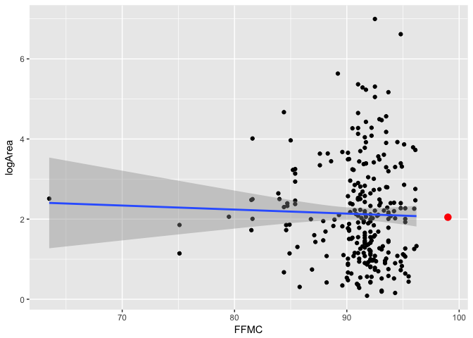

### Assessing Model Fit:

Main question here is: How well does this model fit ?

Let's start by calculating the SSE - Sum of squared errors.

``` r
mod %>%
  augment() %>%
  summarize(SSE = sum(.resid^2))
```

    ##        SSE
    ## 1 424.9158

SSE is a single number which quantifies how much our model missed by. Unfortunately, it is hard to interpret, since its units have been squared. Thus, another common way of thinking about the accuracy of our model is RMSE. The RMSE is essentially the standard deviations of the residuals.

When R prints the summary of the `mod` object, it prints something called `*Residual standard error*`. This is nothing but RMSE.

The RMSE is manually calculated as:

``` r
# sqrt(SSE / df)
sqrt(424.9158/268)
```

    ## [1] 1.259169

You can scroll up to the summary output to check the `Residual standard error` and compare it with the value calculated here. Thus the `RMSE` or `Residual Standard Error` is a single number which quantifies how much our model is unable to explain.

This means that according to our model, the predicted logArea is +/- 1.259 points away from the truth.

### Comparing Model fits:

Consider this, if you had to predict logArea when you didn't have any information regarding FFMC, then what would your best guess be ? The average of logArea! That is, a line with no slope and an intercept of mean(logArea).

Now this type of model is called the "null(average)" model. This model serves as a benchmark as it does not require any insight.

We can fit the null model in R using lm but this time including 1 for the explanatory variable.

``` r
mod_null <- lm(logArea ~ 1, data = ff)
mod_null %>%
  augment() %>%
  summarize(SST = sum(.resid^2))
```

    ##        SST
    ## 1 425.2909

The SSE for the null model is called SST. Compare this with the SSE for our model with the SST for the null model.

The ratio of SSE/SST is a quantification of the variability explained by our model. By building a regression model we hope to explain that variability. The portion of the SST that is *NOT* explained our model is called the SSE.

These ideas are captured in the R-squared value as:

R-squared = 1 - (SSE/SST) - which gives the variability explained by our model.

Interpretation: The proportion of variablity in the response variable that is explained by our model.

Here, I will show how to calculate R-squared manually. Just for the sake of understanding.

1.  First, we will need a lm object
2.  Next, tidy it with broom::augment function
3.  Then use the formula R-squared = 1 - var(e)/var(y)

``` r
mod %>%
  augment() %>%
  summarize(var_y = sd(logArea)^2, var_e = sd(.resid)^2) %>%
  mutate(R_squared = 1 - (var_e/var_y))
```

    ##      var_y    var_e    R_squared
    ## 1 1.581007 1.579613 0.0008819397

Compare this with the R-squared value that you got using the summary function. They are the same.

### Calculating high-leverage points:

The leverage of an observation in a regression model is defined entirely in terms of the distance of that observation from the mean of the explanatory variable. That is, observations close to the mean of the explanatory variable have low leverage, while observations far from the mean of the explanatory variable have high leverage. Points of high leverage may or may not be influential.

The augment() function from the broom package will add the leverage scores (.hat) to a model data frame.

``` r
# Rank points of high leverage
mod %>%
  augment() %>%
  arrange(desc(.hat)) %>%
  select(logArea, FFMC, .fitted, .resid, .hat) %>%
  head()
```

    ##    logArea FFMC  .fitted     .resid       .hat
    ## 1 2.511224 63.5 2.404611  0.1066125 0.20856994
    ## 2 1.854734 75.1 2.287827 -0.4330927 0.07231302
    ## 3 1.144223 75.1 2.287827 -1.1436041 0.07231302
    ## 4 2.059239 79.5 2.243529 -0.1842905 0.03965337
    ## 5 1.724551 81.5 2.223394 -0.4988434 0.02826699
    ## 6 2.479056 81.5 2.223394  0.2556621 0.02826699

### Influence:

Large residual, high leverage, high influence.

As noted previously, observations of high leverage may or may not be influential. The influence of an observation depends not only on its leverage, but also on the magnitude of its residual. Recall that while leverage only takes into account the explanatory variable (x), the residual depends on the response variable (y) and the fitted value (y-hat).

Influential points are likely to have high leverage and deviate from the general relationship between the two variables. We measure influence using `Cook's distance`, which incorporates both the leverage and residual of each observation.

``` r
mod %>%
  augment() %>%
  arrange(desc(.cooksd)) %>%
  select(logArea, FFMC, .fitted, .resid, .hat, .cooksd) %>%
  head()
```

    ##    logArea FFMC  .fitted    .resid        .hat    .cooksd
    ## 1 6.616440 94.8 2.089495  4.526945 0.007536123 0.04944597
    ## 2 1.144223 75.1 2.287827 -1.143604 0.072313022 0.03465508
    ## 3 6.995620 92.5 2.112650  4.882969 0.004284406 0.03249301
    ## 4 4.669646 84.4 2.194198  2.475448 0.015596667 0.03110249
    ## 5 4.012592 81.6 2.222387  1.790205 0.027754419 0.02967478
    ## 6 5.633110 89.2 2.145873  3.487236 0.004612702 0.01785401

Multiple Linear Regression
--------------------------

### Fitting a parallel slopes model

We use the lm() function to fit linear models to data. In this case, we want to understand how the burnt area by forest fire varies as a function of `FFMC` and `season`. From EDA, it appears that `summer` and `fall` seasons tend to have the most extreme forest fires.

We will fit a parallel slopes model using lm(). In addition to the data argument, lm() needs to know which variables you want to include in your regression model, and how you want to include them. It accomplishes this using a formula argument. A simple linear regression formula looks like y ~ x, where y is the name of the response variable, and x is the name of the explanatory variable. Here, we will simply extend this formula to include multiple explanatory variables. A parallel slopes model has the form y ~ x + z, where z is a categorical explanatory variable, and x is a numerical explanatory variable.

Let's start with building a basic lm object

``` r
mod_parallel <- lm(logArea ~ factor(season) + FFMC, data=ff)
summary(mod_parallel)
```

    ## 
    ## Call:
    ## lm(formula = logArea ~ factor(season) + FFMC, data = ff)
    ## 
    ## Residuals:
    ##     Min      1Q  Median      3Q     Max 
    ## -1.9980 -0.9216 -0.1970  0.6816  4.6917 
    ## 
    ## Coefficients:
    ##                      Estimate Std. Error t value Pr(>|t|)  
    ## (Intercept)           0.93577    2.34862   0.398   0.6906  
    ## factor(season)spring  0.04623    0.28902   0.160   0.8731  
    ## factor(season)summer -0.37190    0.17015  -2.186   0.0297 *
    ## factor(season)winter  0.18858    0.36627   0.515   0.6071  
    ## FFMC                  0.01479    0.02573   0.575   0.5659  
    ## ---
    ## Signif. codes:  0 '***' 0.001 '**' 0.01 '*' 0.05 '.' 0.1 ' ' 1
    ## 
    ## Residual standard error: 1.252 on 265 degrees of freedom
    ## Multiple R-squared:  0.02265,    Adjusted R-squared:  0.007901 
    ## F-statistic: 1.536 on 4 and 265 DF,  p-value: 0.1922

Visualize this parallel slopes models: Let's first draw a scatter plot of these 3 variables.

``` r
ff %>%
  ggplot(aes(y = logArea, x = FFMC, color = season)) +
  geom_point()
```

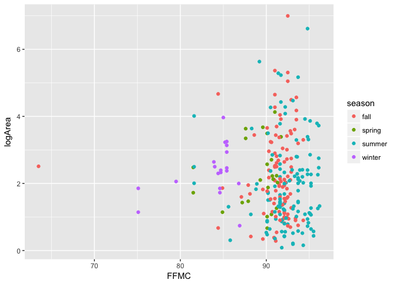

Before we draw the parallel regression lines, we need to take a look at the lm object a bit more carefully. Let's use the augment method to check what is contained in the lm object.

``` r
mod_parallel %>%
  augment() %>%
  head()
```

    ##     logArea factor.season. FFMC  .fitted   .se.fit    .resid        .hat
    ## 1 0.3074847         summer 85.8 1.832889 0.2035601 -1.525405 0.026417805
    ## 2 0.3576744           fall 91.0 2.281702 0.1240754 -1.924028 0.009814831
    ## 3 0.3852624           fall 90.9 2.280223 0.1241878 -1.894961 0.009832621
    ## 4 0.4382549         summer 95.5 1.976357 0.1374147 -1.538102 0.012038652
    ## 5 0.4762342         summer 90.1 1.896488 0.1267640 -1.420254 0.010244799
    ## 6 0.5364934         summer 90.0 1.895009 0.1279885 -1.358516 0.010443677
    ##     .sigma     .cooksd .std.resid
    ## 1 1.251161 0.008269189  -1.234396
    ## 2 1.249118 0.004725133  -1.543863
    ## 3 1.249287 0.004591916  -1.520553
    ## 4 1.251154 0.003720571  -1.235580
    ## 5 1.251693 0.002689808  -1.139877
    ## 6 1.251955 0.002509823  -1.090436

The fitted values for each observation is stored in `.fitted`. The categorical variable is stored as `factor.season`.

Parallel slopes models are so-named because we can visualize these models in the data space as not one line, but two parallel lines. To do this, we'll draw two things:

1.  a scatterplot showing the data, with color separating the points into groups
2.  a line for each value of the categorical variable

Our plotting strategy is to compute the fitted values, plot these, and connect the points to form a line. The `augment()` function from the `broom` package provides an easy way to add the fitted values to our data frame, and the `geom_line()` function can then use that data frame to plot the points and connect them.

``` r
# scatterplot with color
data_space <- ggplot(augment(mod_parallel), aes(y = logArea, x = FFMC, color = factor.season.)) +
  geom_point()

data_space + 
  geom_line(aes(y = .fitted))
```

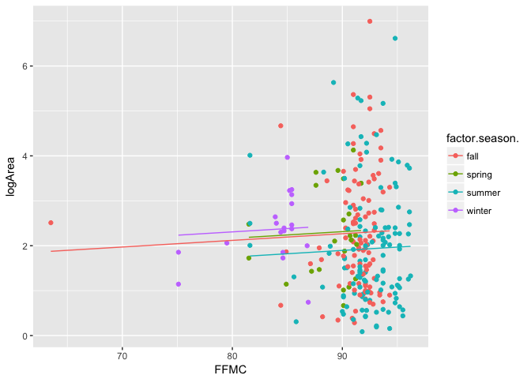

### Checking the predictors

Let's build a model by including all the predictors except X and Y.

``` r
fullModel <- lm(formula = logArea ~ factor(season) + FFMC + DMC + DC + ISI + 
    temp + RH + wind + rain + factor(day), data = ff)

summary(fullModel)
```

    ## 
    ## Call:
    ## lm(formula = logArea ~ factor(season) + FFMC + DMC + DC + ISI + 
    ##     temp + RH + wind + rain + factor(day), data = ff)
    ## 
    ## Residuals:
    ##     Min      1Q  Median      3Q     Max 
    ## -2.1727 -0.8519 -0.1147  0.6123  4.3773 
    ## 
    ## Coefficients:
    ##                        Estimate Std. Error t value Pr(>|t|)   
    ## (Intercept)           1.8545376  3.3774829   0.549  0.58343   
    ## factor(season)spring -0.5215205  0.6773934  -0.770  0.44208   
    ## factor(season)summer -0.7431396  0.2568192  -2.894  0.00414 **
    ## factor(season)winter -0.1376378  0.6737808  -0.204  0.83830   
    ## FFMC                  0.0062437  0.0352803   0.177  0.85967   
    ## DMC                   0.0051726  0.0021268   2.432  0.01571 * 
    ## DC                   -0.0014742  0.0009742  -1.513  0.13148   
    ## ISI                  -0.0187301  0.0297372  -0.630  0.52936   
    ## temp                  0.0149925  0.0271242   0.553  0.58093   
    ## RH                   -0.0056693  0.0078883  -0.719  0.47299   
    ## wind                  0.0602372  0.0467880   1.287  0.19912   
    ## rain                  0.0403758  0.1997045   0.202  0.83994   
    ## factor(day)mon        0.0907444  0.2875435   0.316  0.75258   
    ## factor(day)sat        0.5550105  0.2771514   2.003  0.04630 * 
    ## factor(day)sun        0.3640869  0.2740078   1.329  0.18513   
    ## factor(day)thu        0.1212900  0.3043223   0.399  0.69056   
    ## factor(day)tue        0.3475007  0.2881291   1.206  0.22893   
    ## factor(day)wed        0.0937092  0.3022082   0.310  0.75676   
    ## ---
    ## Signif. codes:  0 '***' 0.001 '**' 0.01 '*' 0.05 '.' 0.1 ' ' 1
    ## 
    ## Residual standard error: 1.241 on 252 degrees of freedom
    ## Multiple R-squared:  0.08712,    Adjusted R-squared:  0.02554 
    ## F-statistic: 1.415 on 17 and 252 DF,  p-value: 0.1294

The overall F-test does not seem to be significant. This indicates that we might need to consider including some interactions and/or higher order terms in the model.

### Interactions

What constitutes interactions to be included ?

### Squared Terms

Wind and RH are good candidates for including a squared term. As the logArea seem to be increasing exponentially.

``` r
ff$RH2 <- (ff$RH)^2
ff$wind2 <- (ff$wind)^2

ggplot(ff, aes(y = logArea, x = RH2)) + geom_point() + geom_smooth(se=FALSE)
```

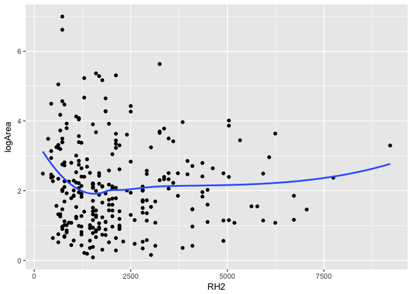

``` r
ggplot(ff, aes(y = logArea, x = wind2)) + geom_point() + geom_smooth(se=FALSE)
```

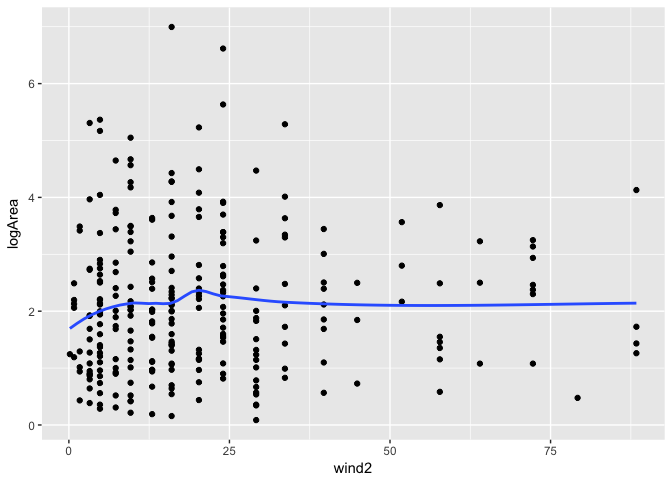

Including RH2 and wind2 in the model

``` r
squaredModel <- lm(formula = logArea ~ factor(season) + FFMC + DMC + DC + ISI + 
    temp + RH + wind + rain + factor(day) + RH2 + wind2, data = ff)

summary(squaredModel)
```

    ## 
    ## Call:
    ## lm(formula = logArea ~ factor(season) + FFMC + DMC + DC + ISI + 
    ##     temp + RH + wind + rain + factor(day) + RH2 + wind2, data = ff)
    ## 
    ## Residuals:
    ##     Min      1Q  Median      3Q     Max 
    ## -2.1765 -0.8554 -0.0901  0.6047  4.2484 
    ## 
    ## Coefficients:
    ##                        Estimate Std. Error t value Pr(>|t|)   
    ## (Intercept)           2.0472088  3.4050675   0.601   0.5482   
    ## factor(season)spring -0.4669600  0.6764853  -0.690   0.4907   
    ## factor(season)summer -0.7005857  0.2562296  -2.734   0.0067 **
    ## factor(season)winter -0.0266919  0.6729453  -0.040   0.9684   
    ## FFMC                  0.0114922  0.0351283   0.327   0.7438   
    ## DMC                   0.0048144  0.0021389   2.251   0.0253 * 
    ## DC                   -0.0013736  0.0009737  -1.411   0.1596   
    ## ISI                  -0.0251064  0.0297600  -0.844   0.3997   
    ## temp                  0.0108714  0.0271652   0.400   0.6894   
    ## RH                   -0.0499998  0.0281622  -1.775   0.0770 . 
    ## wind                  0.3124880  0.1681480   1.858   0.0643 . 
    ## rain                  0.0445693  0.1984309   0.225   0.8225   
    ## factor(day)mon        0.0447164  0.2869339   0.156   0.8763   
    ## factor(day)sat        0.5260001  0.2762087   1.904   0.0580 . 
    ## factor(day)sun        0.3633246  0.2723593   1.334   0.1834   
    ## factor(day)thu        0.0542585  0.3046902   0.178   0.8588   
    ## factor(day)tue        0.3203289  0.2865243   1.118   0.2646   
    ## factor(day)wed        0.0655633  0.3005703   0.218   0.8275   
    ## RH2                   0.0004325  0.0002759   1.568   0.1182   
    ## wind2                -0.0283199  0.0173557  -1.632   0.1040   
    ## ---
    ## Signif. codes:  0 '***' 0.001 '**' 0.01 '*' 0.05 '.' 0.1 ' ' 1
    ## 
    ## Residual standard error: 1.233 on 250 degrees of freedom
    ## Multiple R-squared:  0.106,  Adjusted R-squared:  0.03801 
    ## F-statistic: 1.559 on 19 and 250 DF,  p-value: 0.06696

Including interaction terms:

``` r
squaredInteractionModel <- lm(formula = logArea ~ factor(season) + (FFMC + DMC + DC + ISI)^2 +  temp + RH + wind + rain + factor(day) + RH2 + wind2, data = ff)

summary(squaredInteractionModel)
```

    ## 
    ## Call:
    ## lm(formula = logArea ~ factor(season) + (FFMC + DMC + DC + ISI)^2 + 
    ##     temp + RH + wind + rain + factor(day) + RH2 + wind2, data = ff)
    ## 
    ## Residuals:
    ##     Min      1Q  Median      3Q     Max 
    ## -2.2477 -0.7964 -0.1444  0.6056  3.9446 
    ## 
    ## Coefficients:
    ##                        Estimate Std. Error t value Pr(>|t|)    
    ## (Intercept)           1.025e+00  7.197e+00   0.142 0.886866    
    ## factor(season)spring -4.472e-01  7.674e-01  -0.583 0.560586    
    ## factor(season)summer -1.097e+00  2.839e-01  -3.865 0.000142 ***
    ## factor(season)winter  2.038e-01  8.336e-01   0.244 0.807080    
    ## FFMC                  1.028e-02  8.675e-02   0.118 0.905769    
    ## DMC                  -1.548e-01  9.500e-02  -1.629 0.104549    
    ## DC                    2.409e-02  1.641e-02   1.468 0.143395    
    ## ISI                   3.287e-01  7.854e-01   0.418 0.675973    
    ## temp                 -3.502e-03  2.822e-02  -0.124 0.901341    
    ## RH                   -4.128e-02  2.869e-02  -1.439 0.151485    
    ## wind                  3.783e-01  1.714e-01   2.208 0.028193 *  
    ## rain                 -4.690e-03  1.975e-01  -0.024 0.981072    
    ## factor(day)mon       -3.629e-02  2.874e-01  -0.126 0.899618    
    ## factor(day)sat        5.146e-01  2.736e-01   1.881 0.061183 .  
    ## factor(day)sun        3.282e-01  2.692e-01   1.219 0.223888    
    ## factor(day)thu        3.769e-02  3.065e-01   0.123 0.902228    
    ## factor(day)tue        2.730e-01  2.901e-01   0.941 0.347563    
    ## factor(day)wed        6.051e-02  3.006e-01   0.201 0.840603    
    ## RH2                   3.681e-04  2.807e-04   1.312 0.190886    
    ## wind2                -3.710e-02  1.812e-02  -2.047 0.041684 *  
    ## FFMC:DMC              1.934e-03  1.061e-03   1.824 0.069429 .  
    ## FFMC:DC              -2.654e-04  1.970e-04  -1.347 0.179257    
    ## FFMC:ISI             -3.099e-03  8.361e-03  -0.371 0.711204    
    ## DMC:DC               -1.940e-05  1.161e-05  -1.671 0.095905 .  
    ## DMC:ISI              -7.287e-05  6.953e-04  -0.105 0.916617    
    ## DC:ISI               -1.047e-04  2.054e-04  -0.510 0.610833    
    ## ---
    ## Signif. codes:  0 '***' 0.001 '**' 0.01 '*' 0.05 '.' 0.1 ' ' 1
    ## 
    ## Residual standard error: 1.216 on 244 degrees of freedom
    ## Multiple R-squared:  0.152,  Adjusted R-squared:  0.06506 
    ## F-statistic: 1.749 on 25 and 244 DF,  p-value: 0.01767

In this case the F-test is significant indicating that the regression model fits better than the null model. In other words, atleast 1 predictor in the model can explain the variation in logArea.

Model Selection
---------------

Model Checking
--------------

Interpretation of coefficients
------------------------------

Conclusion
----------
